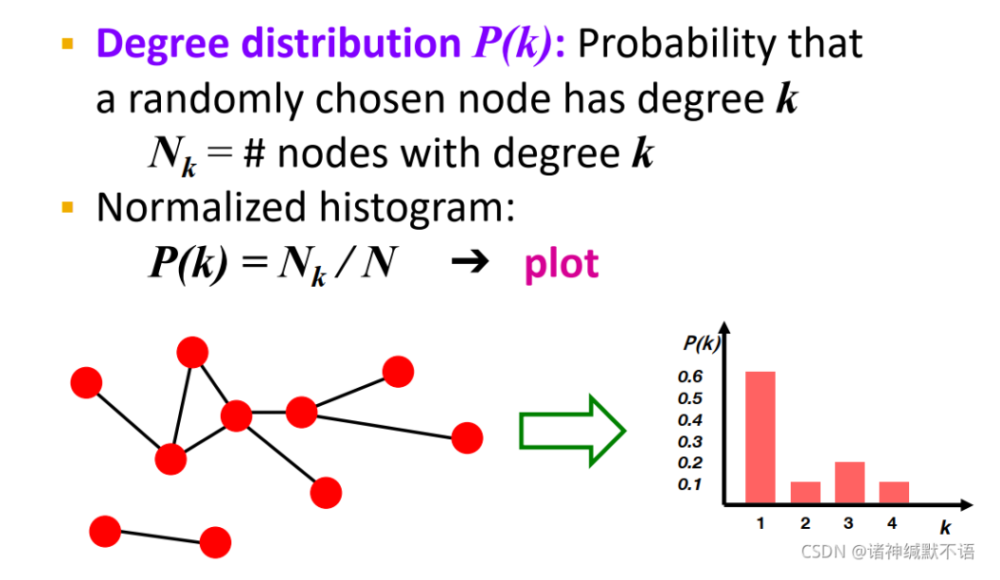

alias:: traditional generative models for graphs

	- [Generative Models for Graphs笔记](https://blog.csdn.net/PolarisRisingWar/article/details/120062898)
		- 本章大纲
			- [[Generative models for graphs]]介绍
			- 真实世界网络的属性
			  id:: 65a89001-d1ad-461a-b687-64c42cdd328f
				- degree distribution，即节点度分布，通常处理为直方图
					- {:height 364, :width 484}
				- [[聚类系数]]
					- $$
					  C_{i}=\frac{e_{i}}{C_{k_{i}}^2}=\frac{2e_{i}}{k_{i}(k_{i}-1)}
					  $$
					  即实际邻居的边/如果所有邻居之间都存在边($C_{k_{i}}^2$)
				- 连通分量
					- 找到连通分量的方法：跑 [[BFS]]模型，标记所有被访问到的节点，如果所有节点被访问到，那么就是一个连通分量；取没有访问到的节点开始重新跑BFS
				- path length，即路径长度，节点对之间最短路径长度称为**距离**，图中最大的节点对间最短路径叫做**直径**
				  $$
				  h=\frac{1}{2E_{\text{max}}}\sum_{i,j\neq i}h_{ij}
				  $$
				  这个公式表示了变量 $h$ 的计算方式。其中，$h_{ij}$ 是节点 $i$ 到节点 $j$ 之间的距离，$E_{\text{max}}$ 是最大边数（即节点对数）$n(n-1)/2$。
			- 传统的图生成模型[[Erdös-Renyi graphs]],[[small-world graphs]] ,[[Kronecker graphs]] 。
-
-
-