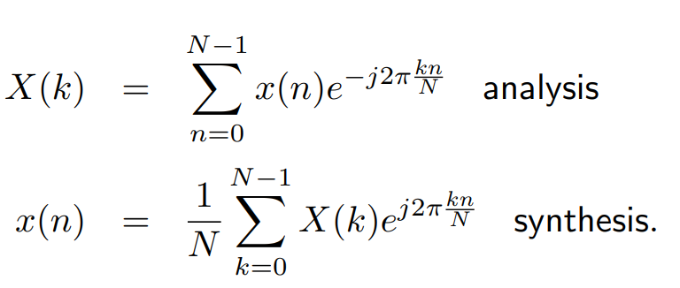
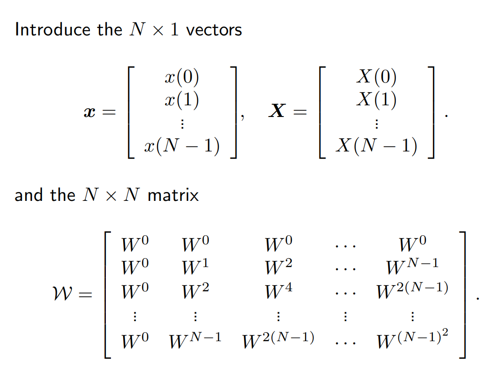

领域:: 数学
类型:: 学习笔记

- 阅读顺序
	- [傅里叶变换 101 — 第 1 部分：真正的傅里叶级数 ](https://medium.com/sho-jp/fourier-transform-101-part-1-b69ea3cb4837)
	- [Fourier Transform 101 — Part 2: Complex Fourier Series |复傅立叶级数](https://medium.com/sho-jp/fourier-transform-101-part-2-complex-fourier-series-934a885b3921)
	- [傅里叶级数与傅里叶变换 - 知乎 (zhihu.com)](https://zhuanlan.zhihu.com/p/366974965) 
	  [傅里叶变换 101 — 第 3 部分：傅里叶变换 |由 Sho Nakagome |sho.jp |中等 (medium.com)](https://medium.com/sho-jp/fourier-transform-101-part-3-fourier-transform-6def0bd2ca9b)
	- [彻底搞懂--离散傅里叶变换和频谱分析-CSDN博客](https://blog.csdn.net/Francis_White/article/details/134868221)
	- [An Introduction to the Discrete Fourier Transform - Technical Articles (allaboutcircuits.com)](https://www.allaboutcircuits.com/technical-articles/an-introduction-to-the-discrete-fourier-transform/)
	- [EE524 (iastate.edu)](https://home.engineering.iastate.edu/~julied/classes/ee524/LectureNotes/l5.pdf)
- 遗留问题：
	- 离散傅里叶变换的推导和意义？
		- **回答**：先从FT推导到DTFT，再到DFT
- 目前清楚：
	- 傅立叶级数、复傅立叶级数
	- 傅立叶级数和傅里叶变换的联系
- $\omega_0=\frac{2\pi}{T}$，此处的$T$是信号的周期，因为三角函数的信号周期应该与其相同，才能够进行级数之后的拟合
- 从实傅立叶级数 -> 复傅立叶级数 -> 傅里叶级数和傅里叶变换的关系，为什么傅里叶变化是积分？（三角函数的频率间隔小，离散求和此处变为了积分）
- 周期性的信号对应的是离散的傅里叶变换，因为可以直接对应于具有周期性的三角函数组合，这些三角函数的具有离散的频率
- 对于周期性的信号而言，因为非周期，可以把周期看作是无穷大，那么这些周期三角函数的频率之间的间隔就会很小，要把这些对于很小很小间隔的三角函数求和，就是积分，由此得到非周期信号连续信号的傅里叶变换
- 对于连续时间信号，其傅里叶变换是
  $$F\left(j\omega\right)=\int_{\infty}^{\infty}\!f\left(t\right)e^{-iwt}\,\mathrm{dt}$$
  接下来我们要讨论DTFT，DTFT是直接对于连续时间信号采样后的傅里叶变换，假设我们的采样间隔是T（这个定义很奇怪，但是采样间隔是T），一共采样了N个点，所以我们现在把这N个点代入傅里叶变换的公式：
  $$F\left(jw\right)=\int_0^{\left(N-1\right)T}\!f\left(t\right)\,e^{-iwt}dt=\int_0^{\left(N-1\right)T}\sum_{k=0}^{N-1}f\left(kT\right)\delta\left(t-kT\right)e^{-iwt}dt=\sum_{k=0^{}}^{N-1}f\left(kT\right)e^{-iwkT}$$
  **就是把采样后的信号，虽然是离散的，但是还是可以看作和FT完全一样去处理（都是非周期的时间信号）DTFT也可以直接把单个离散信号进行FT计算，最后在求和即可，然后就可以根据计算得到的值，得到DTFT是以**$2\pi$为周期的
  >对于每一个\omega，都需要用到N个离散点的信号计算
- 接下来我们进入到DFT
	- 为什么要讨论DFT，因为我们从离散时间采样得到的信号，进行傅里叶变换后，得到的
	  
	  $$F\left(jw\right)=\sum_{k=0^{}}^{N-1}f\left(kT\right)e^{-iwkT}$$
	  依旧是一个周期为2\pi连续函数，计算机无法处理，所以我们现在在在这个连续的$F\left(j\omega\right)$上，在一个周期2\pi内，取这几个点的值$\frac{2\pi}{N}k,k\in(N-1)$，就得到了DFT，我不知道为啥取等间隔的N个点，然后逆变换回去就可以得到原始的离散时间信号
	  
	  
-