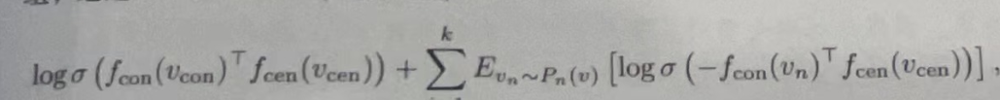

- [优化技巧：负采样和分层softmax ](https://zhuanlan.zhihu.com/p/568064512)
- 图嵌入的思想？ #card
  card-last-interval:: 8.81
  card-repeats:: 1
  card-ease-factor:: 2.6
  card-next-schedule:: 2023-12-28T21:29:03.030Z
  card-last-reviewed:: 2023-12-20T02:29:03.030Z
  card-last-score:: 5
  id:: 657ba2ad-321d-445b-96fa-5a00f2926009
	- 对于原图而言，通过信息提取器提取出来一系列信息
	- 对于原图而言，再通过映射函数（把图节点映射到矩阵）中，再通过重构器函数（函数输入是概率，概率的计算是由嵌入矩阵计算的（嵌入矩阵的得来过程就有学习的参数）），其希望能够最大化重构函数的输出值，这样子就认为这个映射函数是好的，graph embedding is good
- 一般情况下的目标函数和损失函数？ #card
  card-last-interval:: 4.14
  card-repeats:: 1
  card-ease-factor:: 2.36
  card-next-schedule:: 2023-12-24T05:28:48.903Z
  card-last-reviewed:: 2023-12-20T02:28:48.904Z
  card-last-score:: 3
	- 目标函数 : $$\prod_{(v_{conv},v({cen})\in set(\iota )}p(v_{con}|v_{cen})^{\#(v_{con}|v_{cen})}$$，希望最大化目标函数，希望这个连乘函数能够取得最大值，就说明$$p(v_{con}|v_{cen})$$能够反应有效的重构信息
	- 损失函数是目标函数的负对数：$$\ell (W_{conv},W_{cen}) = - \sum_{(v_{conv},v({cen})\in set(\iota)}\#(v_{con},v_{cen})log p (v_{con},v_{cen})$$
	  id:: 657ba444-ee9e-42b9-8b0f-8c22ff0357bc
	- 但是计算$$p(v_{con}|v_{cen})$$的计算量太大，所以还有分层softmax和负采样技术
- 分层softmax技术？ #card
  card-last-interval:: 4.14
  card-repeats:: 1
  card-ease-factor:: 2.36
  card-next-schedule:: 2023-12-24T05:28:44.946Z
  card-last-reviewed:: 2023-12-20T02:28:44.946Z
  card-last-score:: 3
	- [优化技巧：负采样和分层softmax ](https://zhuanlan.zhihu.com/p/568064512)
	- $p(v_{con}|v_{cen})$重新定义，定义为$$\prod_{h=1}^{H}p_{path}(p^{h}|v_{cen}) $$
	- $p(v_3|v_8) = p(left|b_0,v_8)p(right|b_1,v_8)p(left|b_4,v_8)$，其中$p(left|b_0,v_8) = \sigma(f_b(b_0)^Tf(v_8))$
	- 其中$$f 和 f_b$$是需要学习的函数
- 负优化技术？ #card
  card-last-interval:: 4.14
  card-repeats:: 1
  card-ease-factor:: 2.36
  card-next-schedule:: 2023-12-24T05:28:46.303Z
  card-last-reviewed:: 2023-12-20T02:28:46.303Z
  card-last-score:: 3
	- 负采样这一技巧其实在别的算法中也有应用，其适用的场景是结果中正例比较少而负例比较多的情形，就比如word2vec，无论是CBOW模式还是skip-gram模型，整个词库词语数量为V，CBOW预测中间词，输出中只有中间词为1，其余词都为0;skip-gram预测周围词，只有周围有限的n个词为1，其余都为0，这两种模式下都是正例数很少，而负例数很多的情形。
	- 正是基于这样一种实际情况，负采样的思想就是只取所有正样本和部分负样本，比如按照1比10的比例选取负样本，然后整个预测输出的规模就变小了，这样再去计算softmax的时候计算量就很小了。
	- 负采样技术的目标函数(希望目标函数能最大，损失函数能最小)是 ，并且使用这个来代替原始损失函数的$$logp(v_{con}|v_{cen})$$ 
	  ((657ba444-ee9e-42b9-8b0f-8c22ff0357bc))
- 图嵌入需要想要保存的四类信息？ #card
  card-last-interval:: 8.81
  card-repeats:: 1
  card-ease-factor:: 2.6
  card-next-schedule:: 2023-12-28T21:28:38.659Z
  card-last-reviewed:: 2023-12-20T02:28:38.660Z
  card-last-score:: 5
	- 共现节点信息
	- 社区信息
		- 使用模块度定义$$Q = \frac{1}{2m} \sum_{i,j} \left( A_{i,j} - \frac{d_i \cdot d_j}{2m} \right) \delta(c_i, c_j)$$ m是整个图的度$$(c_i = c_j)$$（即节点 (i) 和 (j) 属于同一社区）时为1，否则为0。
	- 角色信息
		- 提取的信息是节点的度排序
		- 重构器需要重构的信息是 $$P_{global} = \prod_{1\leq i \lt  j \leq N}p(v(i),v(j))$$，其中，$$p(v(i),v(j)) = \sigma (w^T(u_{i}-u_{j}))$$，其中u是图嵌入，里面有需要学习的参数，w是也是需要学习的参数
	- 结构信息
		- 需要构建新图
		- 信息提取是通过节点度，以及0-k阶节点的度得来
- {{cards [[图嵌入]]}}