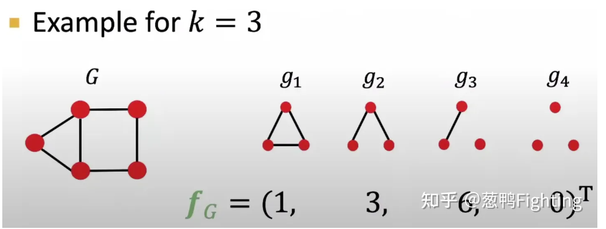

- 总得来说，**核方法**是一种广泛使用的基于图水平的特征表示方法。简单来说，给定两个图 \( G_1 \) 和 \( G_2 \)，图核 \( k(G_1, G_2) \) 定义了图的某种特征向量表示方法 \( \phi(G) \)，并通过计算内积 \( \langle \phi(G_1), \phi(G_2) \rangle \) 来衡量两个图之间的相似度。主要有**图元核方法（Graphlet Kernel）**与**Weisfeiler-Lehman核方法**
- 图元核方法
	- 首先是要知道\[\phi\]函数的定义
		- {:height 265, :width 416}、
		- 就此图而言，我们选择了四个图元，然后分别将\[\phi\]作用与图上，可以根据每一个图元在图上的统计，得到一个\[f_G\]的向量来表示这个图，然后再去计算两图之间的内积从而衡量相似性。
		- 为了避免图之间的差异导致\[\ f_G\]可能潜在的偏斜，所以计算内积之前进行归一化操作\[\frac{f_G}{sum(f_G)}\]
		- 缺点是：**计算量太大**
- [[Weisfeiler-Lehman]]核方法
	- 有点GNN那意思了，通过聚合操作来得到图水平的特征表示
	- [Weisfeiler-Lehman核方法讲解](https://zhuanlan.zhihu.com/p/426532601#:~:text=3.-,Weisfeiler%2DLehman%E6%A0%B8%E6%96%B9%E6%B3%95,-%E5%89%8D%E9%9D%A2%E4%BB%8B%E7%BB%8D%E7%9A%84)
-
-