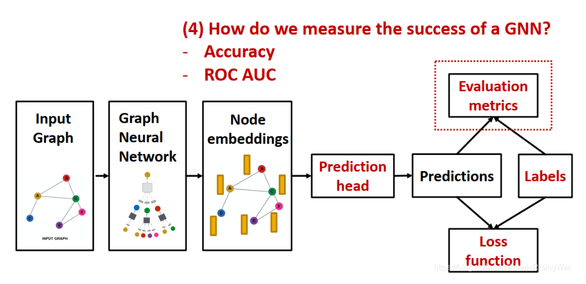

- 相关网址
	- [图神经网络的 10 大学习资源](https://towardsdatascience.com/top-10-learning-resources-for-graph-neural-networks-f24d4eb2cc2b)
	- [PyG官方文档](https://pytorch-geometric.readthedocs.io/en/latest/tutorial/create_gnn.html) 超级好的PyG官方文档
- 相关知识
	- [[图神经网络数学基础]]
	- 图深度学习的通用结构
	  id:: 659a4c68-4c5e-4ba0-afec-718de154bdc5
	  collapsed:: true
		- {:height 260, :width 511}
		- ①单层GNN的结构 {{embed ((65992c7b-f387-42ae-bcaf-ccdffbadb580)) }}
		- ②预测头
		  collapsed:: true
			- 节点级别
				- \[\hat{y}_v = \text{Head}_{\text{node}}(h_v^{(L)}) = \mathbf{W}^{(H)} h_v^{(L)}\]其中 \(\mathbf{W}^{(H)} \in \mathbb{R}^{k \times d}\)，将 \(d\) 维嵌入映射到 \(k\) 维输出，然后再做[[分类任务]]或者[[回归任务]]的损失函数计算
			- 边级别，用节点嵌入对来做预测
				- \[ y_{uv} = \text{Head}(\text{edge}(h_u(L), h_v(L))) \]，例如$$\hat{y}_{uv} = \text{Linear}(\text{Concat}(h_u^{(L)}, h_v^{(L)}))$$
				- 还可以使用点积的方式来进行预测
					- 如果直接点积
					  collapsed:: true
						- 仅适用于one-way预测这类任务，因为点积输出是一个值，例如边预测是否存在
						  $$y_{uv} = (h_u^{(L)})^T h_v^{(L)}$$
					- 对于k-way预测，使用点积的话，还可以计算多组点积合并，得到-way输出
					  $$
					  \hat{y}_{uv}^{(1)} = (h_u^{(L)})^T W^{(1)} h_v^{(L)}
					  $$
					  $$
					  \vdots
					  $$
					  $$
					  \hat{y}_{uv}^{(k)} = (h_u^{(L)})^T W^{(k)} h_v^{(L)}
					  $$
					  $$
					  \hat{y}_{uv} = \text{Concat}(\hat{y}_{uv}^{(1)}, \ldots, \hat{y}_{uv}^{(k)}) \in \mathbb{R}^k
					  $$
			- 图级别：用图中所有节点的嵌入向量来做预测
				- $$\hat{y}_G = \text{Head}_{\text{graph}}\left(\{h_v^{(L)} \in \mathbb{R}^d, \forall v \in G\}\right)$$
				  \[\text{Head}_{\text{graph}}(\cdot) \]与GNN单层中\[AGG(\cdot)\]类似，都是将若干嵌入聚合为一个嵌入。
				- 可以选择的\[\text{Head}_{\text{graph}}(\cdot) \]
					- 全局均值池化（global mean pooling）:
					  $$
					  \hat{\mathbf{y}}_G=\textcolor{red}{\text{Mean}}(\{\mathbf{h}_v^{(L)}\in\mathbb{R}^d,\forall v\in G\})
					  $$
					- 全局最大池化（global max pooling）:
					  $$
					  \hat{\mathbf{y}}_G=\textcolor{red}{\text{Max}}(\{\mathbf{h}_v^{(L)}\in\mathbb{R}^d,\forall v\in G\})
					  $$
					- 全局求和池化（global sum pooling）:
					  $$
					  \hat{\mathbf{y}}_G=\textcolor{red}{\text{Sum}}(\{\mathbf{h}_v^{(L)}\in\mathbb{R}^d,\forall v\in G\})
					  $$
				- 问题：大图上的global pooling会存在[丢失信息的问题](https://blog.csdn.net/PolarisRisingWar/article/details/118001121#:~:text=%E4%BF%A1%E6%81%AF%E7%9A%84%E9%97%AE%E9%A2%98%E3%80%82-,%E4%B8%BE%E4%BE%8B%EF%BC%9A%E4%BD%BF%E7%94%A8%E4%B8%80%E7%BB%B4%E8%8A%82%E7%82%B9%E5%B5%8C%E5%85%A5%E3%80%82,-G%201%20G_1)：
					- 解决方法：[[hierarchical global pooling]]
		- ③预测和标签
		  collapsed:: true
			- 监督学习
			  collapsed:: true
				- 建议将监督学习任务规约到三种粒度下的标签预测任务，因为这种预测任务有很多已做过的工作可资参考，会好做些。例如聚类任务可视为节点属于某一类的预测任务。
			- 无监督学习：使用图自身的信号来作为有监督学习的标签
				- 节点级别：节点统计量（如[[聚类系数]], [[PageRank]]等）
				  边级别：链接预测（隐藏两节点间的边，预测此处是否存在链接）
				  图级别：图统计量（如预测两个图是否同构）
		- ④损失函数
		  collapsed:: true
			- [[分类任务]][[交叉熵损失函数]]
			- [[回归任务]]可以使用[[MSE]]等
		- ⑤[[评价指标]]
		- ⑥[切分数据集](https://blog.csdn.net/PolarisRisingWar/article/details/118001121#:~:text=2.5-,%E5%88%87%E5%88%86%E6%95%B0%E6%8D%AE%E9%9B%86,-%E5%B0%86%E6%95%B0%E6%8D%AE%E9%9B%86)
	- [[图增强]]
	- [[图论基础]]
	- [[图嵌入]]
-
-
-
-