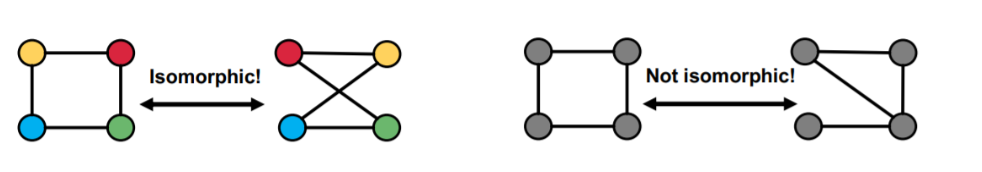

alias:: 同构

- 两个图 \( G = (V, E) \) 和 \( G' = (V', E') \) 被称为同构的，如果存在一个双射 \( f: V \rightarrow V' \) 使得对于任意的 \( u, v \in V \)，当且仅当 \( (u, v) \in E \) 时，\( (f(u), f(v)) \in E' \)。换句话说，存在一个双射 \( f \)，使得 \( u \) 和 \( v \) 之间存在边当且仅当 \( f(u) \) 和 \( f(v) \) 之间也存在边。
- 
- 可以从度的角度简单判断是否同构