-
- GNN 基本概念
	- 度中心性
	- 中介中心性
		- 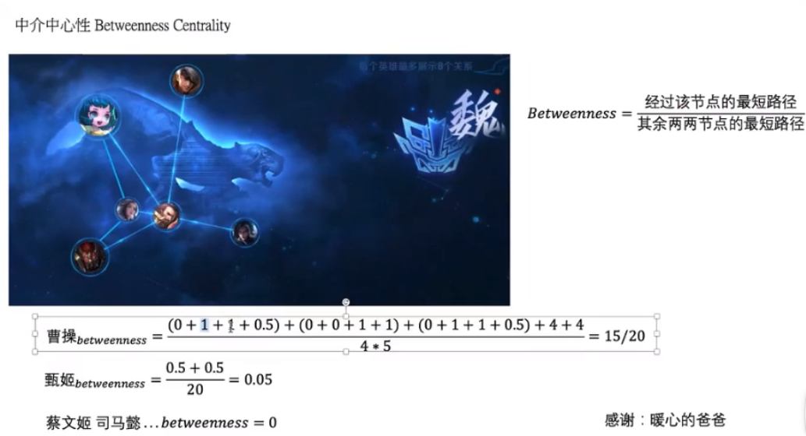{:height 358, :width 548}
	- 连接中性性
		- 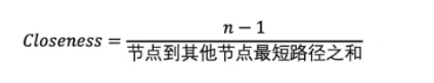
	- pagerank算法
	- hits算法
- GNN可以有很多层
	- GNN的本质就是更新各部分特征
	- 其中输入是特征，输出也是特征，邻接矩阵也不会变的
- GNN输出的特征能做什么
	- 各个点特征组合，可以做分类
	- 各个节点也可以分类
	- 边也可以分类
	- 其实只是利用图结构得到特征，最终要做什么还是我们自己定
- [[GCN 图卷积]]
	- 输入：各节点输入特征、网络图结构
	- 优势：
		- 半监督，少量标签也能训练
		- 计算损失时只用有标签的
	- 计算方法
		- $$\hat{D}^{-\frac{1}{2}} \hat{A} \hat{D}^{-\frac{1}{2}} X$$
		-
		- > D是度矩阵，A是邻接矩阵，X是特征矩阵
		- > 这样做的原因是，用度矩阵对于邻接矩阵做行和列的归一化，因为需要对关系权重进行更新
		-
		- 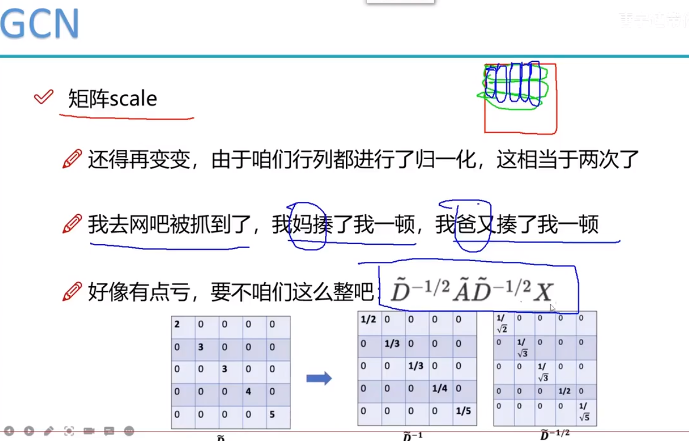{:height 412, :width 435}
		- GCN例子
			- 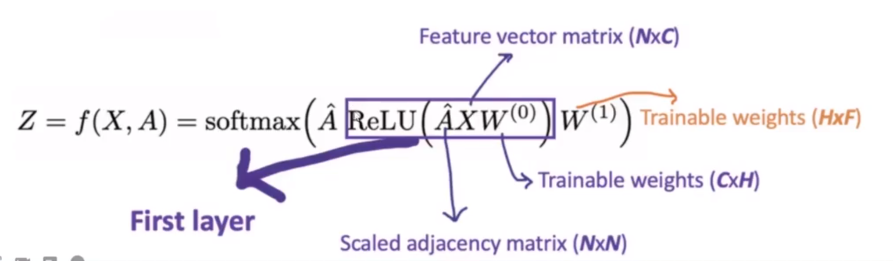{:height 203, :width 682}
		- 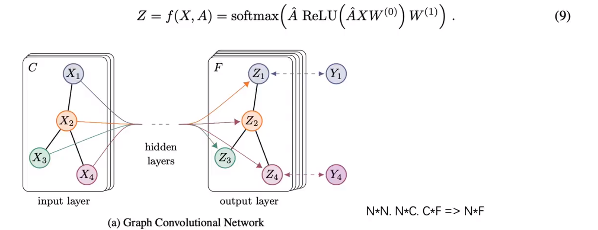
		- GCN的层数
			- **一般的实验发现GCN两三层就比较合适了，多了反而更差**
		-
- [[GAT 图注意力机制]]
	- 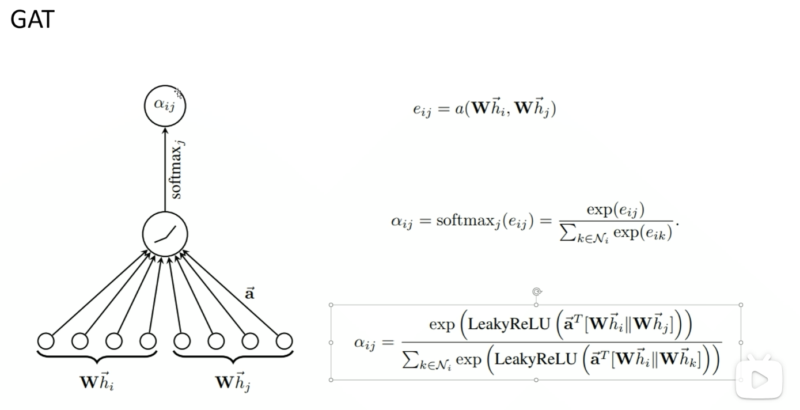
		- 其中 $W和\hat{a}$是可以学习的参数，$\hat{h}_i和\hat{h}_j$是i,j两个元素的特征值,||表示将两个向量拼接起来。所以整个式子表示的意思就是通过ij两个节点的特征来计算重要性。
		-
	- 多头注意力机制
		- 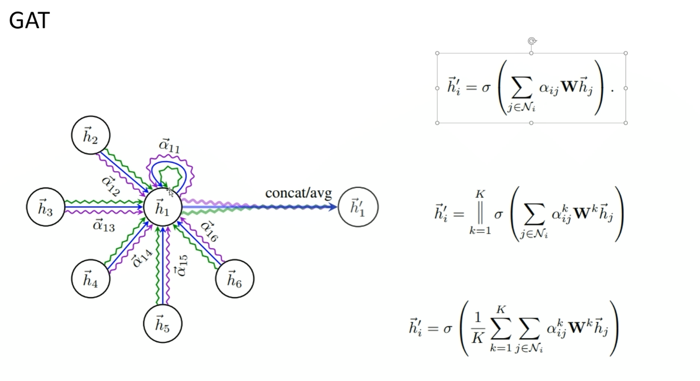
		- 训练三套注意力机制，最后平均最后的注意力加和
- [[GraphSAGE]] [GraphSAGE视频](https://www.bilibili.com/video/BV1bM411j7Dn?p=10&vd_source=19d43a740c787dccf39bbc5751d77b0c)
	- 聚合机制 mean、pooling、LSTM
	- minbatch -- 减少内存
	- 无监督学习
		- 损失函数原理：相近节点的embedding接近，远的节点embedding不接近
		  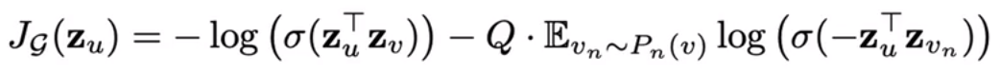
- [[HAN 异构图]]
	- [HAN算法理论](https://www.bilibili.com/video/BV1bM411j7Dn?p=19&vd_source=19d43a740c787dccf39bbc5751d77b0c)
	- 基本概念：
		- 异构图定义：节点的类别＋边的类别 >2
		- meta path： 分为节点级别和语义级别
		  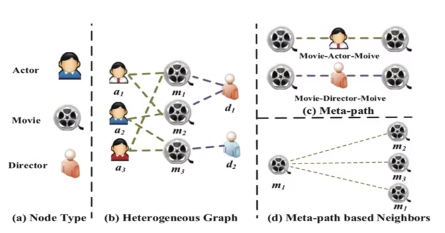{:height 213, :width 382}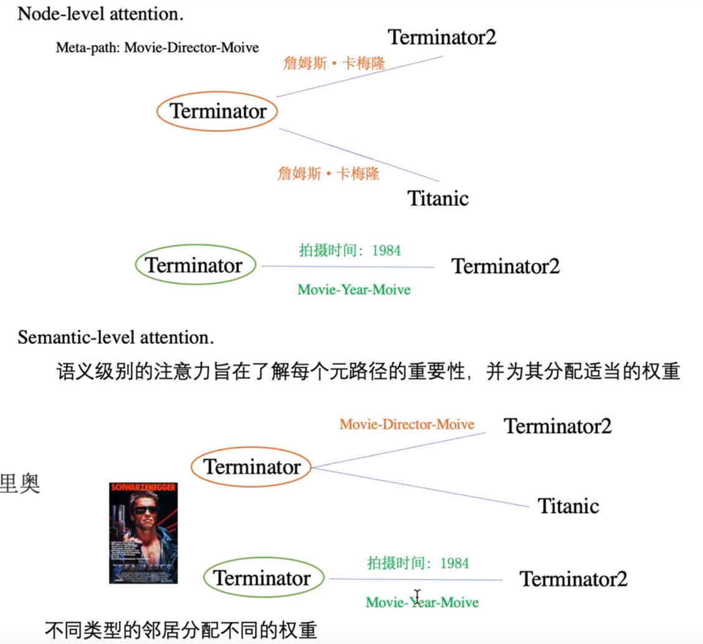{:height 392, :width 409}
		  元路径其实是不同分类分类下的同构图
		- 先做节点级别再做语义级别的attention
			- 语义级别的attention
			- 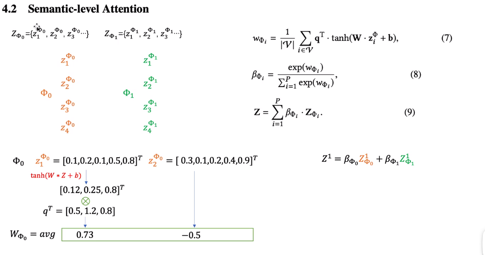
		- **流程图**
		  :LOGBOOK:
		  CLOCK: [2023-08-16 Wed 17:51:10]
		  :END:
		  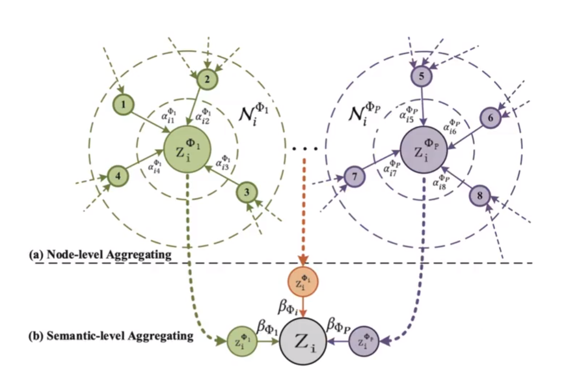
- [[TopKpooling]]    [TopkPooling进行下采样任务](https://www.bilibili.com/video/BV1j8411876K?p=21&vd_source=19d43a740c787dccf39bbc5751d77b0c)
	- K是一个具体的数值
	- 其中大致意思是输入一个邻接矩阵和特征参数矩阵，经过pooling后只得到位于topK前的邻接矩阵和特征参数
	- 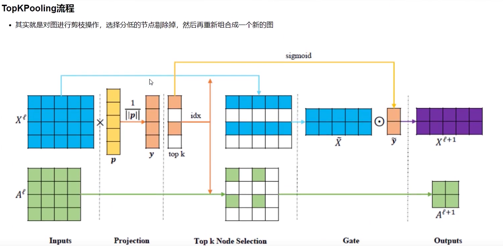
		- X是特征参数矩阵，A是邻接矩阵``
		- p是可以学习的一个矩阵，y是得分，A根据得分将剔除过后的节点的相关行和列都删除