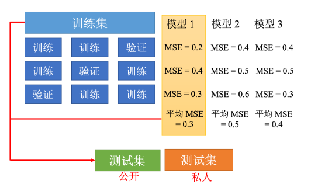
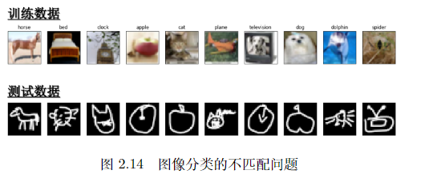

## 第二章 实践方法论
card-last-score:: 5
card-repeats:: 1
card-next-schedule:: 2023-11-23T14:11:13.863Z
card-last-interval:: 4
card-ease-factor:: 2.6
card-last-reviewed:: 2023-11-19T14:11:13.864Z
	- 模型偏差 #模型分析 #card
	  card-last-score:: 5
	  card-repeats:: 2
	  card-next-schedule:: 2024-01-24T04:42:11.632Z
	  card-last-interval:: 4
	  card-ease-factor:: 2.7
	  card-last-reviewed:: 2024-01-20T04:42:11.632Z
		- 模型太简单，灵活性不够
		- 模型越大灵活性越强
	- 优化问题 #模型分析 #card
	  card-last-score:: 5
	  card-repeats:: 2
	  card-next-schedule:: 2024-01-24T04:42:25.993Z
	  card-last-interval:: 4
	  card-ease-factor:: 2.7
	  card-last-reviewed:: 2024-01-20T04:42:25.994Z
		- 如何判断是模型灵活性不好，还是优化存在问题
		- 如何考虑灵活性、优化以及模型过拟合的优先顺序？
		  card-last-score:: 5
		  card-repeats:: 1
		  card-next-schedule:: 2023-11-23T14:19:01.147Z
		  card-last-interval:: 4
		  card-ease-factor:: 2.6
		  card-last-reviewed:: 2023-11-19T14:19:01.148Z
		  collapsed:: true
			- 先判断训练集上的灵活性和优化是否解决，再去比较和测试集是否存在过拟合的问题
	- 过拟合问题 #模型分析 #card
	  card-last-interval:: 11.2
	  card-repeats:: 3
	  card-ease-factor:: 2.8
	  card-next-schedule:: 2024-01-31T08:45:53.570Z
	  card-last-reviewed:: 2024-01-20T04:45:53.570Z
	  card-last-score:: 5
		- 解决方法
			- 1 -数据增强
				- 数据增强的要考虑的内容 #模型分析 #card
				  card-last-interval:: 4
				  card-repeats:: 2
				  card-ease-factor:: 2.7
				  card-next-schedule:: 2024-01-24T04:42:47.141Z
				  card-last-reviewed:: 2024-01-20T04:42:47.141Z
				  card-last-score:: 5
					- 要考虑真实情况，不能随便增强
			- 2- 给模型限制
				- 模型限制的方法 #模型分析 #card
				  card-last-interval:: 4
				  card-repeats:: 2
				  card-ease-factor:: 2.7
				  card-next-schedule:: 2024-01-24T04:42:41.392Z
				  card-last-reviewed:: 2024-01-20T04:42:41.392Z
				  card-last-score:: 5
					- 减少参数
					- 选用较少的特征
					- 正则化和Dropout
	- 交叉验证 #模型分析 #card
	  card-last-interval:: 4
	  card-repeats:: 2
	  card-ease-factor:: 2.7
	  card-next-schedule:: 2024-01-24T04:45:43.871Z
	  card-last-reviewed:: 2024-01-20T04:45:43.871Z
	  card-last-score:: 5
		- K折交叉验证的内容 #模型分析 #card
		  card-last-interval:: 4
		  card-repeats:: 2
		  card-ease-factor:: 2.7
		  card-next-schedule:: 2024-01-24T04:45:42.262Z
		  card-last-reviewed:: 2024-01-20T04:45:42.262Z
		  card-last-score:: 5
			- {:height 225, :width 375}
	- 不匹配 #模型分析 #card
	  card-last-interval:: 4
	  card-repeats:: 2
	  card-ease-factor:: 2.7
	  card-next-schedule:: 2024-01-24T04:45:36.262Z
	  card-last-reviewed:: 2024-01-20T04:45:36.262Z
	  card-last-score:: 5
		- 不匹配问题的原因是？ #模型分析 #card
		  card-last-interval:: 11.2
		  card-repeats:: 3
		  card-ease-factor:: 2.8
		  card-next-schedule:: 2024-01-31T08:45:46.437Z
		  card-last-reviewed:: 2024-01-20T04:45:46.437Z
		  card-last-score:: 5
			- 训练集和测试集分布不同，增大训练集也没有用，和过拟合问题不一样
			  