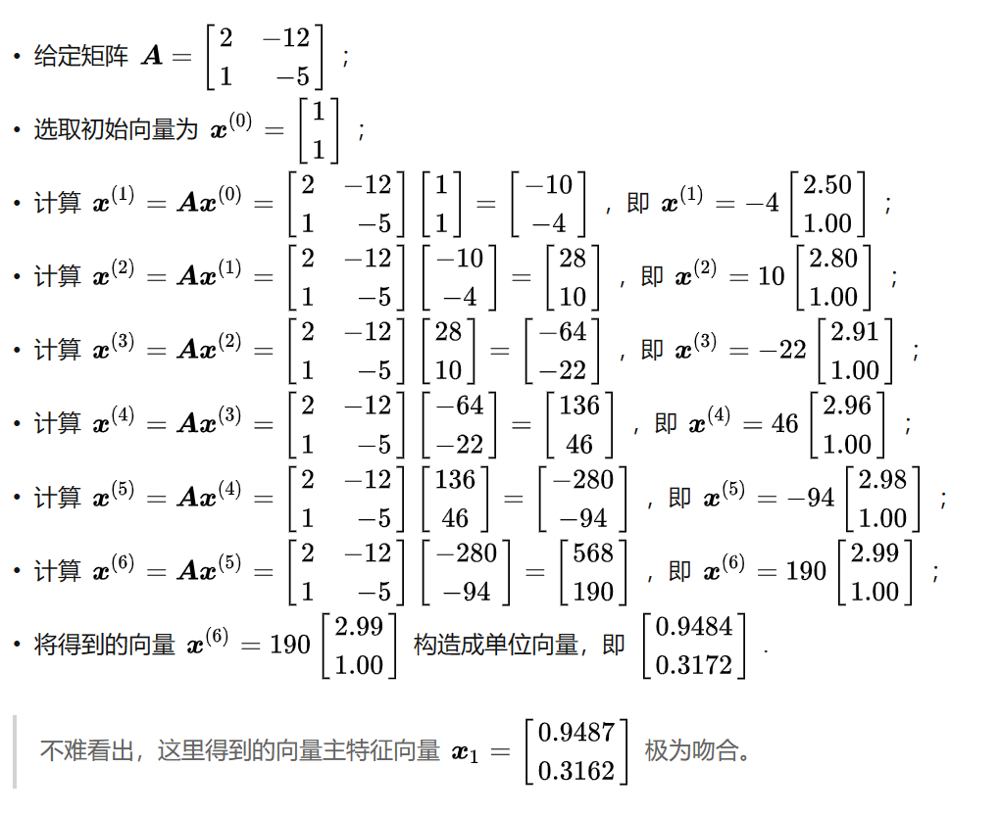

- 幂迭代 **(power iteration)** 法是线性代数中一种非常重要的方法，若给定矩阵 \[\boldsymbol{A}\in\mathbb{R}^{n\times n}\] 存在主特征值和主特征向量，可以选取一个非零向量 \[\boldsymbol{x}^{(0)}\in\mathbb{R}^{n}\]作为逼近主特征向量的初始向量，进行迭代得到主特征向量。
	- 目的：快速得到主特征向量
	- 举例：
	  {:height 680, :width 538}