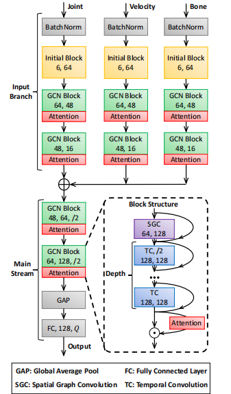
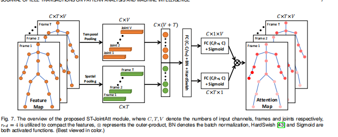
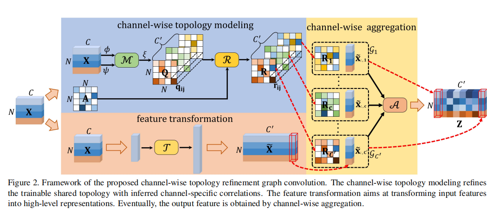
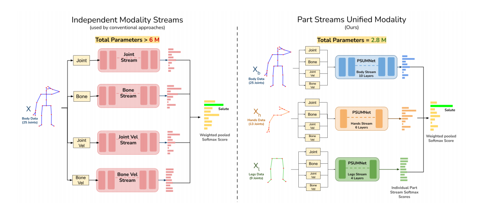
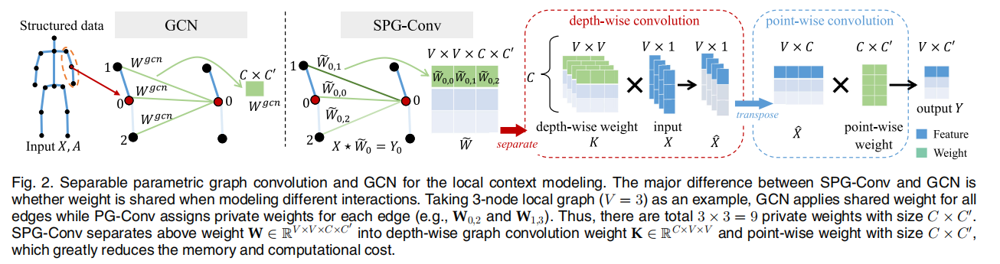
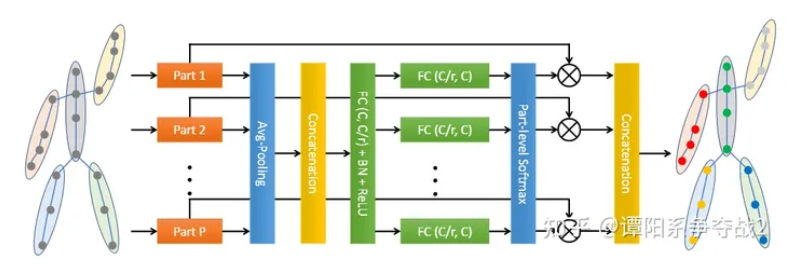
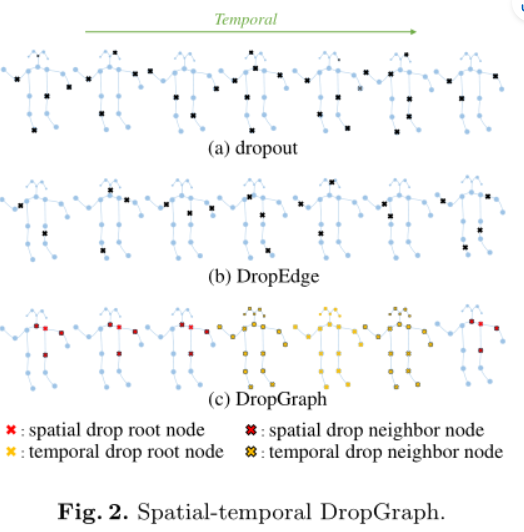
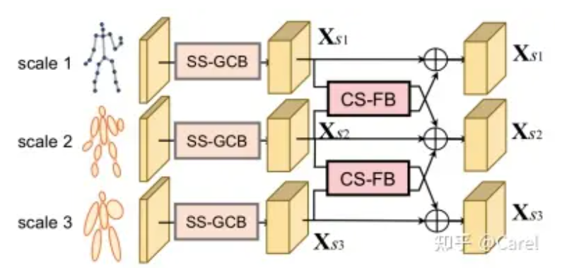
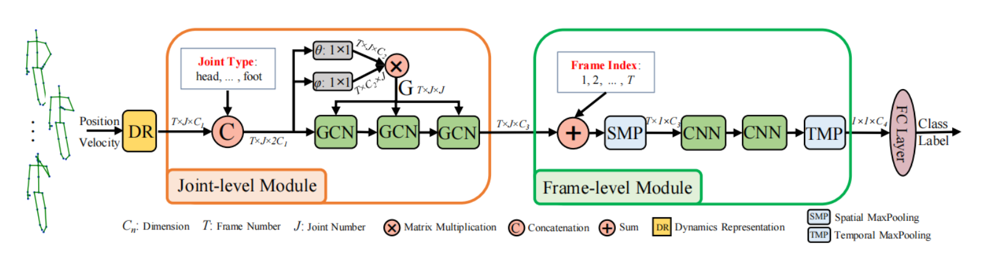
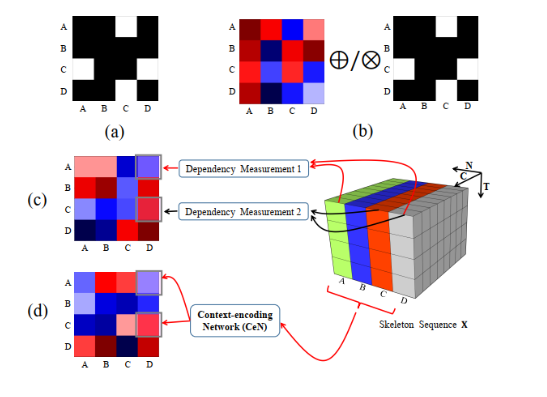

- 2021
	- DONE Constructing Strong and Fast Baseline for skeleton-based action recognition 
	  card-last-score:: 5
	  card-repeats:: 2
	  card-next-schedule:: 2023-11-30T04:43:40.002Z
	  card-last-interval:: 4
	  card-ease-factor:: 2.46
	  card-last-reviewed:: 2023-11-26T04:43:40.002Z
	  {:height 231, :width 131} {:height 180, :width 406} 
	  主要目标： {{cloze 减少冗余的参数，保持性能   }}
	  四个方法和创新 ①输入： {{cloze **使用了三个维度的输入，位置、运动和骨架信息** }}②卷积操作上使用了 {{cloze **可分离卷积操作**}} ③注意力机制是 {{cloze 对节点和时间帧的统一建模，对**整个跨时间区域的节点进行注意力**}}④引入了一个新的策略 {{cloze 超参数选择策略 }} #毕业设计有用 #时空注意力 #多尺度时间卷积 #card
	- CTR-GCN: Channel-wise topology refinement graph convolution for skeleton-based action recognition #card 
	  card-last-interval:: 4
	  card-repeats:: 2
	  card-ease-factor:: 2.7
	  card-next-schedule:: 2023-11-30T04:43:41.532Z
	  card-last-reviewed:: 2023-11-26T04:43:41.532Z
	  card-last-score:: 5
	  {:height 333, :width 633}
	  主要目标： {{cloze 为每一个通道增加非共享拓扑结构 }} 创新① {{cloze 通道维度的拓扑，非共享}}② 时间卷积{{cloze 时间维度的多尺度聚合机制}} 对毕设带来的思考：这个其实也没有完全细分，**不同时间跨度的相同通道依旧共享，可以考虑对于不同时间通道的特征进行进一步的细分**。 #毕业设计有用
- 2022
	- {:height 384, :width 862}
	  card-last-interval:: 4
	  card-repeats:: 1
	  card-ease-factor:: 2.36
	  card-next-schedule:: 2023-11-22T05:56:25.526Z
	  card-last-reviewed:: 2023-11-18T05:56:25.526Z
	  card-last-score:: 3
	  主要目的： {{cloze 减少参数，实现可部署，轻量化}}创新① {{cloze 分区域卷积，每个区域内有可以部分共享的节点，并且每一个区域的点都是在全局下注册，并且每个分区的卷积数量也不同，根据节点多少的比例分配卷积层数量}}②输入 {{cloze 多流输入，**骨架、节点、运动信息三个层面输入，并且拼接在一个维度减少计算量**}}③注意力机制 {{cloze 和CTR-GCN差不多，对于输入分为两个流，每个流均进行（C*T*V）进行1*1卷积，减少通道维度，然后时间池化，最后两个相同操作的流进行相减得到注意力。但是少去了为每一个通道建立拓扑的操作，取而代之的是使用共享拓扑}} #输入 #注意力机制 #card
	-
- 2020
	- MV-IGNet： Learning Multi-view interactional skeleton graph for action recognition
	  card-last-interval:: 4
	  card-repeats:: 2
	  card-ease-factor:: 2.46
	  card-next-schedule:: 2023-11-30T04:44:23.241Z
	  card-last-reviewed:: 2023-11-26T04:44:23.241Z
	  card-last-score:: 5
	  
	  主要目的： {{cloze 更强大的特征提取能力}} 创新①特征提取方法： {{cloze 使用depthwise 和 pointwise 同时实现了注意力和特征提取，简化了计算，并且完成了分区操作，这个分区操作很重要，想要实现将25个节点进行分区，输入的邻接矩阵U*V，其中U_i行每一个元素代表的是V中元素到U_i的对应权重，如果在分区，就有权重，不在分区，应该就设置为0，可不可以不设置为0？也是一种创新}} ②分区： {{cloze 通过U*V矩阵巧妙地完成了分区}} #毕业设计有用 #card
	- PartResAtt : Stronger, faster and more explainable: a graph convolution baseline for skeleton-based action recognition.
	  card-last-interval:: 4
	  card-repeats:: 2
	  card-ease-factor:: 2.7
	  card-next-schedule:: 2023-11-30T04:44:29.977Z
	  card-last-reviewed:: 2023-11-26T04:44:29.977Z
	  card-last-score:: 5
	  
	  本文学习到的东西： {{cloze **多模态融合对提升有效，所以本文的多模态信息很重要，毕业设计的本身信息就比较少**}}  #毕业设计有用 #card
	- Decoupling GCN with DropGraph
	  id:: 654cdc41-8a65-4f35-8893-32862e43be50
	  card-last-interval:: 4
	  card-repeats:: 2
	  card-ease-factor:: 2.7
	  card-next-schedule:: 2023-11-30T04:44:31.195Z
	  card-last-reviewed:: 2023-11-26T04:44:31.195Z
	  card-last-score:: 5
	  {:height 240, :width 247}
	  主要目的： {{cloze 引入DropGraph减少过拟合}} 创新① {{cloze DropGraph}} ②很常见了，为每一个通道构建邻接矩阵，前面有CTR-GCN为每一个通道通过卷积和注意力机制构建邻接矩阵，后面有MV-IGNet通过depthwise和pointwise机制为每一个通道构建邻接矩阵，并且减少了计算量。 #毕业设计有用 #card
	- DMGNNDynamic multiscale graph neural networks for 3Dskeleton-based human motion prediction
	  card-last-interval:: 4
	  card-repeats:: 2
	  card-ease-factor:: 2.22
	  card-next-schedule:: 2023-11-30T04:44:04.302Z
	  card-last-reviewed:: 2023-11-26T04:44:04.302Z
	  card-last-score:: 3
	  {:height 238, :width 483}
	  主要目的： {{cloze 对不同人体尺度的特征提取并且互相指导}} 创新① {{cloze 前期单独scale特征提取时，A矩阵先初始化但是是可以训练的。}} ② 跨区域互相指导： {{cloze **得到指导map的操作很关键，其实这个操作的核心就是得到map以及如何得到map，最常见的得到map就是对每一个节点，提取全局注意力，就如同本文，首先在S1 scale中，对节点i，先计算节点i对其余所有节点的一个总和值r，然后再对将i的值和r进行计算得到一个i和所有节点的关系值h。然后对S1的节点值向量和S2中的节点值向量进行向量乘法，得到map。这种操作是考虑到所有节点关系的，很重要。**}} #毕业设计有用 #card
	- Semantics-Guided Neural Networks for Efficient Skeleton-Based Human Action Recognition  
	  card-last-interval:: 4
	  card-repeats:: 1
	  card-ease-factor:: 2.6
	  card-next-schedule:: 2023-11-22T06:02:45.169Z
	  card-last-reviewed:: 2023-11-18T06:02:45.169Z
	  card-last-score:: 5
	  主要目的： {{cloze 添加语义信息}} 创新：① {{cloze 语义信息的加入，实现方法是先给每个节点进行语义的onehot编码，然后经过MLP层将其转化一个合适的维度，最后embedding到节点的特征信息中；时间语义一样，先onehot编码，然后MLP转化为合适的维度，然后将embedding加入到对应T下的节点特征中（concat）}} #card
	- Context Aware Graph Convolution for skeleton-based action recognition
	  card-last-interval:: 4
	  card-repeats:: 2
	  card-ease-factor:: 2.7
	  card-next-schedule:: 2023-11-30T04:44:27.090Z
	  card-last-reviewed:: 2023-11-26T04:44:27.090Z
	  card-last-score:: 5
	  主要目的： {{cloze 减少因为扩大感受野而引入的冗余计算}} 创新： ① 语义信息的获取{{cloze 计算语义信息的，然后将其add or concact在特征后面，最后进行GCN}} ②不一样的卷积： {{cloze **实现了边和点的图卷积**}} #毕业设计有用 #card
	- CeGCN: Dynamic GCN - Context-enriched topology learning for skeleton-based action recognition
	  card-last-interval:: 4
	  card-repeats:: 2
	  card-ease-factor:: 2.7
	  card-next-schedule:: 2023-11-30T04:44:07.146Z
	  card-last-reviewed:: 2023-11-26T04:44:07.147Z
	  card-last-score:: 5
	  {:height 405, :width 547}
	  主要目的： {{cloze 全局方式合并得到邻接矩阵}} 创新：①新的注意力方式 {{cloze 上下文特征将以全局方式合并，不同于nonlocal，该方式首先聚合T、C最后得到的维度为N,V,1,1,此时的V中聚合了全局时段的特征信息，再去计算V*V图。}} ②该方法的效果不错。 #毕业设计有用 #注意力机制 #card