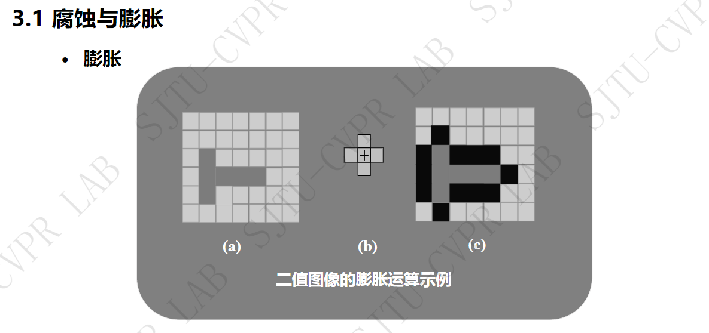
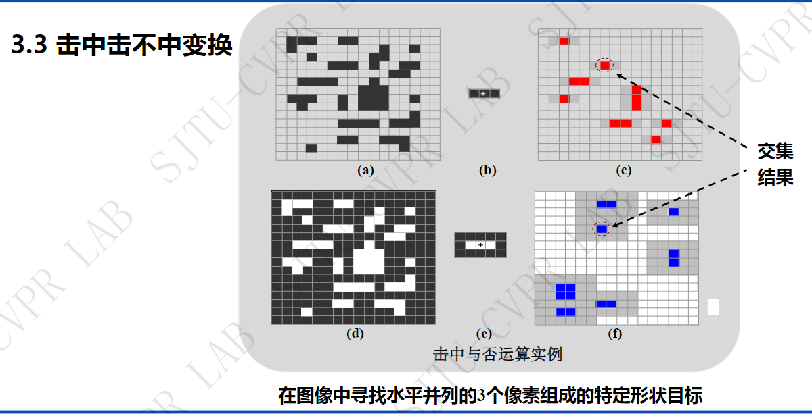
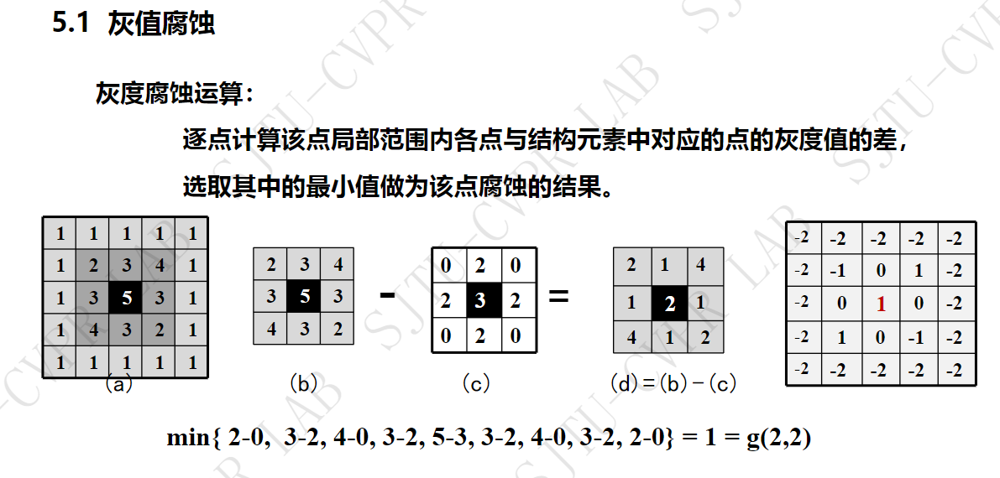
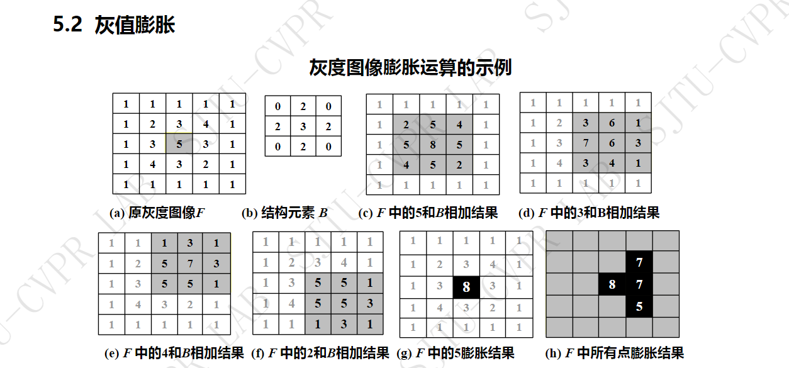
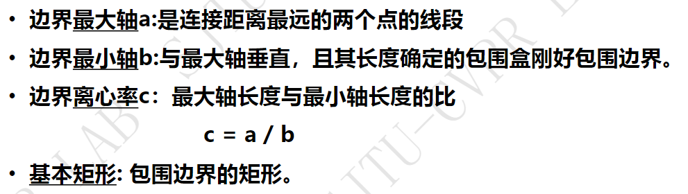

## 02 形态学处理
	- 
	- #### 应用
		- OCR
		- 视觉跟踪--行人入侵跟踪、基于视觉的车辆检查与跟踪
		- 医学图像处理
		- 工业检测、生物特征识别等
	- #### 集合论基本知识
	  collapsed:: true
		- 包含、击中、击不中
		- 逻辑运算 -- 与或非
	- #### 形态学基本概念
		- 基本思路
		  collapsed:: true
			- 形态学运算的效果取决于**结构单元的大小、内容、逻辑运算的性质**
			- ((650c1851-2102-4cf9-b04a-263a30cc7a16))
		- 处理目的
		  collapsed:: true
			- 发掘二值图中的拓扑形态关系
		- 二值形态学的基本运算
			- 腐蚀
			  collapsed:: true
				- 腐蚀运算的实质就是在目标图像中标出那些与**结构元素相同的子图像的原点位置的像素**
			- 膨胀
			  collapsed:: true
				- ①填充小孔②磨平图像向外的尖角
				- 
			- 开运算--先腐蚀再膨胀
			  collapsed:: true
				- 去掉长凸起、边缘、毛刺和孤立点
			- 闭运算--先膨胀再腐蚀
			  collapsed:: true
				- 融合缺口、去掉小洞、填补轮廓上的缝隙
			- 击中击不中变换
			  id:: 656c1707-4d98-4bca-8c28-2283713f5c32
				- 第一次腐蚀是找有这个形状
				- 第二次腐蚀是确保这个形状是孤立的
				- {:height 314, :width 599}
		- 主要二值图像形态学图像处理算法
		  collapsed:: true
			- 边缘提取
			  collapsed:: true
				- 可以是膨胀减去原图、腐原图减去蚀、也可以是膨胀减去腐蚀（形态学梯度）
			- 区域填充
			- 细化
			  collapsed:: true
				- 是**提取骨架**的算法
				- ((650c2230-4bde-42b9-a036-0776dac1804f))
			- 厚化
			- 骨架提取
		- 灰度形态学图像处理算法
		  collapsed:: true
			- 不能够使用逻辑运算
			- 灰度腐蚀
			  collapsed:: true
				- 
			- 灰度膨胀
			  collapsed:: true
				- {:height 316, :width 659}
			- 灰度开运算
			  collapsed:: true
				-
				-
- ## 第七章
	- 
	- 边界描述
		- 链码
		  collapsed:: true
			- 一般定义四方向或者八方向
			- 重采样避免噪音干扰--表达的尺度比较大‘
			- 解决多意性
				- 构成的链码的自然数值最小
				- 进一步：最小循环首差链码（四向链码 4 进制、八向链码 8进制）最右边开始减，依次减去左边的位值，再去做最小值
		- 形状数：形状数是基于链码的一种边界形状描述符
		  collapsed:: true
			- 起始位置不同，可以有多个1阶差分，形状数是差分中最小的一个序列
			- 阶：形状数的长度，闭合曲线，阶总是偶数
			- 形状数的构建
				- 最大轴、最小轴、离心率
					- 
				- ((65437c0c-380e-40ab-bd33-cc04207d0f6a))
		- 傅里叶描述子
		  collapsed:: true
			- ((65437d16-47b9-43ca-ba1e-815bb54b7e4b))的用途
				- 不同的离散傅里叶变换点数对应提取的离散傅里叶点数，点数越多，重构越细节。
				- 可以用较小的点数牺牲细节，但是可以得到大致的轮廓，同时节省了计算量
				- ((65437d64-2028-48e1-b8b9-a04eff59ece9))
	- 纹理描述
		- 标志三要素
			- 序列在更大的区域内重复
			- 序列结构大致相同
			- 序列基本元素非随机排列
		- 灰度差分统计法
			- 没有考虑方向
		- ((654382c5-5cd4-40e9-bc82-3c5cac22017e))（联合概率矩阵法）
			- [灰度共生矩阵（超简单理解）-CSDN博客](https://blog.csdn.net/qq_36654309/article/details/106473599)
			- 再根据灰度共生矩阵去计算其他的二阶统计量
	- 形状上下文算法
		- [图像形状上下文特征ShapeContexts_形状上下文特征描述子-CSDN博客](https://blog.csdn.net/u013972657/article/details/110468333)
		- 步骤
			- canny（门限不一样，点就不一样多）
			- 对轮廓点进行适当的采样
			- 构建形状上下文直方图矩阵
	- 尺度不变特征变换匹配算法 SIFT [图像特征匹配方法——SIFT算法原理及实现-CSDN博客](https://omnivore.app/me/sift-csdn-18bb39052c3)
		- 特点
			- 独特性
			- 多量性
			- 速度快
			- 拓展性强
		- 步骤
	- 尺度不变特征变换匹配算法 哈里斯角点检测算法