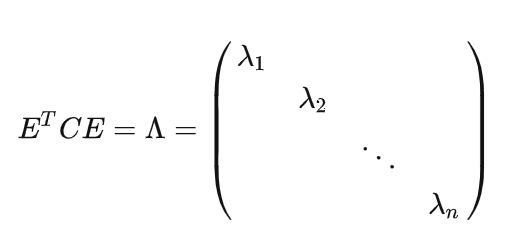

site:: [ai-start.com](http://www.ai-start.com/ml2014/)
date-saved:: [[Nov 9th, 2023]]

- site:: [知乎专栏](https://zhuanlan.zhihu.com/p/353905922)
  date-saved:: [[Nov 9th, 2023]]
  [逻辑斯谛回归 - 动手学机器学习 (boyuai.com)](https://hml.boyuai.com/books/chapter6#%E4%B9%A0%E9%A2%98)
- ## 第一周
	- 监督学习和无监督学习
	- 单变量线性回归问题
	- 代价函数
	- **梯度下降算法**
- ## 第二周
	- 多维特征
	- 多变量梯度下降
		- 对于数据进行归一化，不然收敛较慢
	- 正规方程
		- 可以实现直接求取的使得代驾函数最小的$\theta$
		- 仅限于线性方程、可逆矩阵
		- 计算量很大
- ## 第三周
	- 逻辑回归（分类模型）
		- 逻辑回归的函数$H(\theta) = \frac{1}{1+e^{-\theta ^T X}}$这个值始终在0-1之间
		  :LOGBOOK:
		  CLOCK: [2023-11-16 Thu 21:08:17]
		  :END:
	- **逻辑回归的代价函数** #card
	  card-last-interval:: 4
	  card-repeats:: 1
	  card-ease-factor:: 2.6
	  card-next-schedule:: 2023-11-22T06:50:14.920Z
	  card-last-reviewed:: 2023-11-18T06:50:14.920Z
	  card-last-score:: 5
		- $$J(\theta) = -y log(h(\theta))-(1-y)(log(1-h(\theta))$$
	- **正则化问题** #card
	  card-last-interval:: 4
	  card-repeats:: 1
	  card-ease-factor:: 2.6
	  card-next-schedule:: 2023-11-22T06:50:07.497Z
	  card-last-reviewed:: 2023-11-18T06:50:07.497Z
	  card-last-score:: 5
		- 在代价函数中加入对参数的惩罚，**参数越大，那么惩罚越大**
		- {:height 136, :width 781}
		- {:height 135, :width 783}
		- 注意，不对$\theta _0$不做惩罚
- ## 第四周
	- 非线性假设
	- 神经元和大脑
	- 模型表示
		- $$\theta ^{(j)}表示第j -> j+1层的权重参数矩阵$$
		- $$a_i ^j表示第j层的第i个激活单元$$
	- 特征和直观理解
	- 多类分类问题
- ## 第五周
	- 神经网络的代价函数 #card
	  card-last-interval:: 4
	  card-repeats:: 1
	  card-ease-factor:: 2.6
	  card-next-schedule:: 2023-11-22T06:49:59.377Z
	  card-last-reviewed:: 2023-11-18T06:49:59.377Z
	  card-last-score:: 5
		- 
	- 神经网络的方向传播
		- 链式法则求导，输出对激活层求导、激活层对加和层求导、加和层对前一个激活层求导……
- ## 第六周
	- 机器学习的建议
		- 交叉验证模型 #card
		  card-last-interval:: 4
		  card-repeats:: 1
		  card-ease-factor:: 2.6
		  card-next-schedule:: 2023-11-22T06:49:49.150Z
		  card-last-reviewed:: 2023-11-18T06:49:49.151Z
		  card-last-score:: 5
			- train，val，test
				- 其中train的模型对于val的损失函数值就是交叉验证代价损失
		- 模型选择
			- 训练出10个模型
			- 选择交叉验证最小的模型（val）
			- 计算test的代价函数值
		- 查准率和查全率 #card
		  card-last-interval:: 4
		  card-repeats:: 1
		  card-ease-factor:: 2.6
		  card-next-schedule:: 2023-11-22T06:49:47.162Z
		  card-last-reviewed:: 2023-11-18T06:49:47.162Z
		  card-last-score:: 5
			- 查准率：precision $$P = \frac{预测为正且本来就是正的样本}{预测为正的样本}$$
			- 查全率：recall $$R = \frac{预测为正且本来就是正的样本}{所有正的样本}$$
			- 查全率和查准率是一对矛盾的量，一个高的话，另一个必定低，关系图如下
			- {:height 256, :width 324}
			- 查全率和查准率之间的平衡点，一般是使用F1系数表示：$$F_1= \frac{2PR}{P+R}$$
- ## 第七周 支持向量机
	- 数学基础
		- site:: [拉格朗日函数](https://blog.csdn.net/qaqwqaqwq/article/details/123421989)
		- site:: [支持向量机（SVM）](https://www.zhihu.com/tardis/zm/art/31886934?source_id=1005)
- ## 第八周
	- k-means聚类算法算法思想 #card
	  card-last-interval:: 4
	  card-repeats:: 1
	  card-ease-factor:: 2.6
	  card-next-schedule:: 2023-11-22T06:49:40.230Z
	  card-last-reviewed:: 2023-11-18T06:49:40.231Z
	  card-last-score:: 5
- ## 第九周
	- 讲解：[非常详细易懂的PCA讲解](https://zhuanlan.zhihu.com/p/77151308)
	- PCA的维度
		- N维 -> K维，其中K维是正交的，原因在[协方差](https://zhuanlan.zhihu.com/p/77151308#:~:text=%E5%B7%AE%E5%80%BC%E6%9C%80%E5%A4%A7%E3%80%82-,2.2%20%E5%8D%8F%E6%96%B9%E5%B7%AE,-%E5%9C%A8%E4%B8%80%E7%BB%B4)
	- PCA的求解步骤：假设有m条数据，每条数据有n个维度
		- 排列成$$X \in R^{m*n}$$的矩阵数据
		- 对每一列矩阵数据进行零均值化，便于数值处理，这样子方差就变喂为了$$Var(a) = \frac{1}{m}\sum^m_{i=1}a^2_i$$协方差就变成$$Con(a,b)=\frac{1}{m-1}\sum^m_{i=1}a_ib_i$$，实际计算上，为了进一步简化，按照$$Con(a,b)=\frac{1}{m}\sum^m_{i=1}a_ib_i$$计算协方差,
		- 求出协方差矩阵$$C = \frac{1}{m}X^TX$$，可以看出在零均值前提下：对角线上是方差，非对角线元素是协方差
		  
		- 希望经过一组正交集P，在这组正交集下X的坐标为Y = PX，我们希望这组坐标Y构成的协方差矩阵D 是一个对角矩阵
			- 这样的意义是：只有方差没有协方差，这样就完成PCA的优化目的 **将一组 N 维向量降为 K 维，其目标是选择 K 个单位正交基，使得原始数据变换到这组基上后，各变量两两间协方差为 0，而变量方差则尽可能大（在正交的约束下，取最大的 K 个方差）。**
		- 变换前后的协方差矩阵满足 $$D = PCP^T$$，其中C是实方差矩阵，D是对角矩阵
		- 之后就是数学处理
			- 实对称矩阵不同特征值对应的特征向量必然正交。 设特征向量λ重数为 r，则必然存在 r 个线性无关的特征向量对应于λ，因此可以将这 r 个特征向量单位正交化。一个 n 行 n 列的实对称矩阵一定可以找到 n 个单位正交特征向量组成的向量矩阵E
			- 一定存在 {:height 156, :width 247}
			- 所以我们要找的一组正交变换向量P，就是C的一组正交特征向量E的转置。
		-
- ## 第十周
	- 异常检测 [粗略看了一眼]
		- 异常是相对于其他观测数据而言有明显偏离的
	- 当正样本的数量很少，甚至有时候是0，即出现了太多没见过的不同的异常类型，对于这些问题，通常应该使用的算法就是异常检测算法。
-