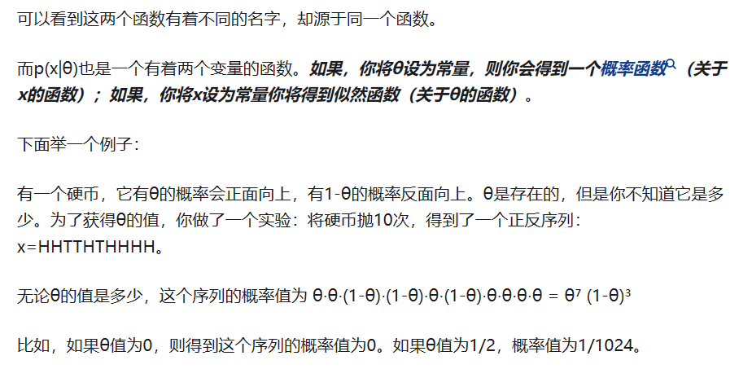

- 极大似然是机器学习中常用到的数学工具，是从**已知数据来估计最真实的模型参数的过程**，通常情况下，我们知道模型的分布，但是不知道其具体参数，那么我们就假设参数为$\theta$，然后计算所有已知数据的概率，如果这个$\theta$接近真实的$\theta$，那么所有已知数据的概率乘积应该很大
  似然和概率之间的关系：
  >   
  似然是参数的函数，概率是变量的函数，似然是在参数确定的情况下，得到的关于\theta的函数
	- 为什么所有已知数据的概率乘积应该很大？
		- 因为数据是从模型中抽样出来的，这些数据能够被抽样出来说明他们本身在模型中概率就很大
- 回忆步骤：
	- 先看讲解，再看链接1讲解，再看链接2的例子
	- [通俗地理解概率论中的「极大似然估计法」](https://www.zhihu.com/question/24124998)
	- [极大似然的例子](https://zhuanlan.zhihu.com/p/152614797)