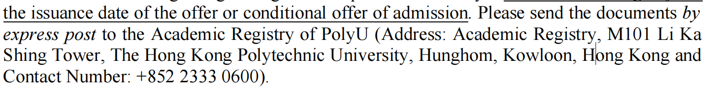

- 4.16-4.23
	- TODO 完成毕业生填报
	- TODO 完成模型的构建、论文进度60%
	- TODO  习惯喜马拉雅、克制屏幕使用时长
- 4.8-4.15
  collapsed:: true
	- DONE 完成摘要和相关工作部分
	- DONE 继续学习anqi的内容
	- DONE 毕业设计论文
	- DONE  模型改为mediapipe手部关键点模型
- 4.1- 4.7
  collapsed:: true
	- DONE 对比学习加入模型，画图
	- DONE 论文彻底看懂
	- DONE 提交Polyu的资料
	  
- 3.25 - 3.31
  collapsed:: true
	- DONE SPM学习、CONN学习
	  collapsed:: true
		- andi brain book中提供了很多教学视频，教学视频先看，操练，之后不懂得再去看视频和文字教程
	- DONE PolyU所有材料提交 ((65fa5e9d-8378-4408-8099-1bc78c57855c))
	- DONE 记忆 [[boremann分区]]
	- DONE 十二点前睡觉
	- DONE 提交PolyU的资料
	- DONE 鞋子清洗
	- DONE [[信]]
	- DONE 深度聚类综述 - 学习并且用于毕业论文和答辩[【超详细】深度聚类-CSDN博客](https://blog.csdn.net/allein_STR/article/details/128569765)
	  [深度聚类：使用深度神经网络进行聚类 (parasdahal.com)](https://www.parasdahal.com/deep-clustering)