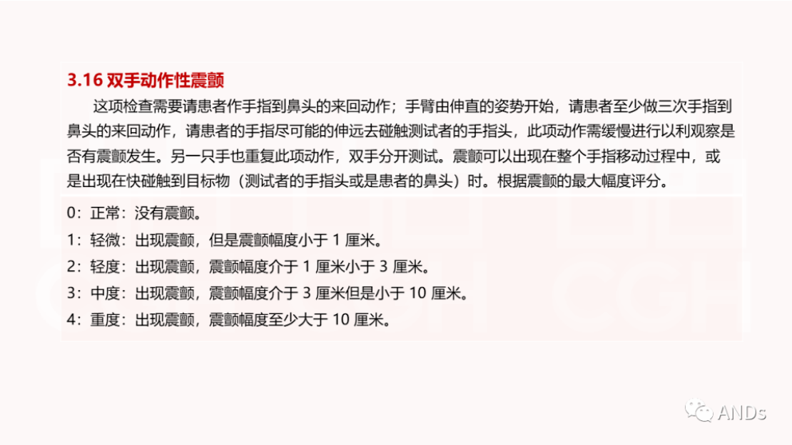
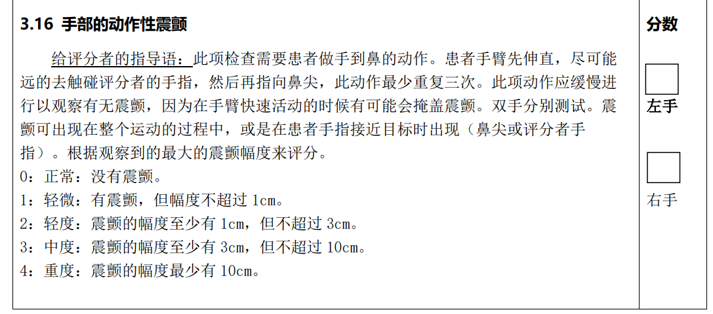

- 帕金森病手部动作性震颤视频的智能评估研究
- [上海交通大学毕业设计(论文)智能管理系统 (sjtu.edu.cn)](https://bysj.jwc.sjtu.edu.cn/Main/Main.aspx?sid=Zo1p1drFhVMZBqUvqUEKzA....&screen=ANxe/Bvj1LRU3NX2Kltqbg....)
- 帕金森手部资料
	- 任务
		- {:height 282, :width 482}
		- {:height 297, :width 648}
- 骨架开源资料合集
	- [基于骨架的动作识别 ·GitHub 主题](https://github.com/topics/skeleton-based-action-recognition)
- 对于现有开源的资料中学习新的机制的算法，如添加注意力的实现
- 继续阅读非开源代码的文章，看看能不能实现