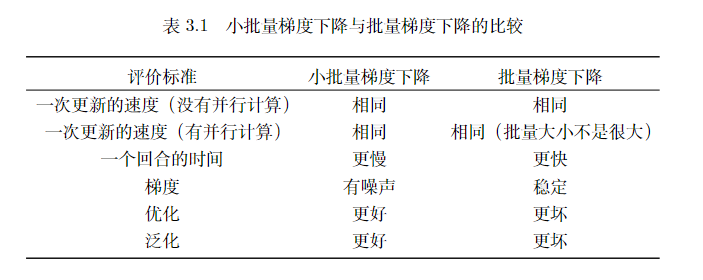

-
	- **3.1局部最小值和鞍点**
		- 损失梯度为零时，可能是局部最小值，也可能是鞍点。
		  
		- 判断临界值种类的方法 #深度学习初步 #card
		  card-last-interval:: 33.64
		  card-repeats:: 4
		  card-ease-factor:: 2.9
		  card-next-schedule:: 2024-02-22T19:45:07.652Z
		  card-last-reviewed:: 2024-01-20T04:45:07.653Z
		  card-last-score:: 5
		  $$L(\theta) = L(\theta^`)+(\theta - \theta^`)^Tg + \frac{1}{2}(\theta - \theta^`)^TH(\theta - \theta^`)$$
		  其中H是海森矩阵，g是一阶导数，H是二阶导数矩阵
		  当为临界点时，g = 0，所以只需要判断 $$L(\theta) = L(\theta^、) + \frac{1}{2}(\theta - \theta^`)^TH(\theta - \theta^`) =L(\theta) = L(\theta^、) + \frac{1}{2}vHv^T  $$
		  当我们判断H的正定性，就可以知道 ((655b4e4d-cbee-4b6d-8366-f2f1bddb370a))
		- 逃离鞍点的方法
			- 多数的时候，我们训练到一个梯度很小的地方，参数不再更新，此时，我们往往只是遇到了鞍点
	- **3.2 批量和动量**
		- 小批量和大批量各有优点 #深度学习初步 #card
		  card-last-interval:: 11.2
		  card-repeats:: 3
		  card-ease-factor:: 2.8
		  card-next-schedule:: 2024-01-31T08:44:49.116Z
		  card-last-reviewed:: 2024-01-20T04:44:49.116Z
		  card-last-score:: 5
			- 小批量，梯度有噪声，泛化性和优化性都更好
			  大批量，梯度更稳定，但是泛化性和优化性更差
			  
		- 动量法 #深度学习初步 #card
		  card-last-interval:: 11.2
		  card-repeats:: 3
		  card-ease-factor:: 2.8
		  card-next-schedule:: 2024-01-31T08:43:45.872Z
		  card-last-reviewed:: 2024-01-20T04:43:45.872Z
		  card-last-score:: 5
			- 每一次更新时考虑前一次的动量，可以帮助逃离局部最小值
			  {:height 174, :width 452}
	- **3.3自适应学习率**
		- 为什么需要自适应学习率
			- 梯度不下降只是因为单纯的震荡
			- 学习率太小了不能够满足前进到损失最小值处
		- AdaGrad
			- AdaGrad 可以做到梯度比较大的时候，学习率就减小，梯度比较小的时候，学习率就放大
		- RMSProp #深度学习初步 #card
		  card-last-interval:: 10.24
		  card-repeats:: 3
		  card-ease-factor:: 2.56
		  card-next-schedule:: 2024-01-30T09:44:08.031Z
		  card-last-reviewed:: 2024-01-20T04:44:08.032Z
		  card-last-score:: 5
			- 引入了新的超参数
			  
		- Adam #深度学习初步 #card
		  card-last-interval:: 28.3
		  card-repeats:: 4
		  card-ease-factor:: 2.66
		  card-next-schedule:: 2024-02-17T11:45:01.467Z
		  card-last-reviewed:: 2024-01-20T04:45:01.467Z
		  card-last-score:: 5
			- RMSProp + 动量
	- **3.4 学习率度量**
		- 在自适应学习率方法中，我们并没有改变η（学习率），只是使用了梯度的统计效果来改变(σ)
		- 使用学习率下降的方法
		- 使用预热的方法
			- 让学习率先变大后变小
	- **3.5 优化总结**
		- 优化的最终公式？ #深度学习初步 #card
		  card-last-interval:: 11.2
		  card-repeats:: 3
		  card-ease-factor:: 2.8
		  card-next-schedule:: 2024-01-31T08:44:58.514Z
		  card-last-reviewed:: 2024-01-20T04:44:58.514Z
		  card-last-score:: 5
			- 
	- **3.6 分类问题**
		- 分类问题选择交叉熵的原因 #深度学习初步 #card
		  card-last-interval:: 11.2
		  card-repeats:: 3
		  card-ease-factor:: 2.8
		  card-next-schedule:: 2024-01-31T08:44:15.282Z
		  card-last-reviewed:: 2024-01-20T04:44:15.282Z
		  card-last-score:: 5
			- ((655b6019-60e1-4325-a882-5d9836dc603d))
	- **3.7 批量归一化**
		- 归一化的目的是什么？ #深度学习初步 #card
		  card-last-interval:: 11.2
		  card-repeats:: 3
		  card-ease-factor:: 2.8
		  card-next-schedule:: 2024-01-31T08:43:58.068Z
		  card-last-reviewed:: 2024-01-20T04:43:58.069Z
		  card-last-score:: 5
			- 是为了得到更好的误差表面，帮助更好的收敛和更快的收敛
			- ((655b6160-e5b0-4c33-8599-ad37d593bc34))
		- 批量归一化适用条件，为什么？ #深度学习初步 #card
		  card-last-interval:: 11.2
		  card-repeats:: 3
		  card-ease-factor:: 2.8
		  card-next-schedule:: 2024-01-31T08:43:42.508Z
		  card-last-reviewed:: 2024-01-20T04:43:42.508Z
		  card-last-score:: 5
			- 适用于批量比较大的时候
			- 这样的分布能够表示整个数据集的分布
	- **3.10 测试时的批量归一化**
		- 首先测试时候的是不需要批量归一化的，因为没有批量这个概念，测试时候的归一化是从训练集中得到的。
		  id:: 655bf85b-a553-4d89-806e-9611fa9cd490
		  {:height 65, :width 197}
		  这个就是训练时候的每一个批量的结果，p是一个超参数，在pytorch中这个方案是已经设置好的
		- 当我们在有批量归一化后，可以考虑把学习率设置得比之前大一些。 #深度学习初步 #card
		  card-last-interval:: 11.2
		  card-repeats:: 3
		  card-ease-factor:: 2.8
		  card-next-schedule:: 2024-01-31T08:44:22.242Z
		  card-last-reviewed:: 2024-01-20T04:44:22.243Z
		  card-last-score:: 5
			- 因为更容易训练，误差表面更好了。
	- **3.11 内部协变量偏移** #深度学习初步 #card
	  card-last-interval:: 11.2
	  card-repeats:: 3
	  card-ease-factor:: 2.8
	  card-next-schedule:: 2024-01-31T08:44:42.552Z
	  card-last-reviewed:: 2024-01-20T04:44:42.552Z
	  card-last-score:: 5
		- 每一层的参数在更新过程中，会改变下一层输入的分布，神经网络层数越多，表现得越明显，(就比如高层大厦底部发生了微小偏移，楼层越高，偏移越严重