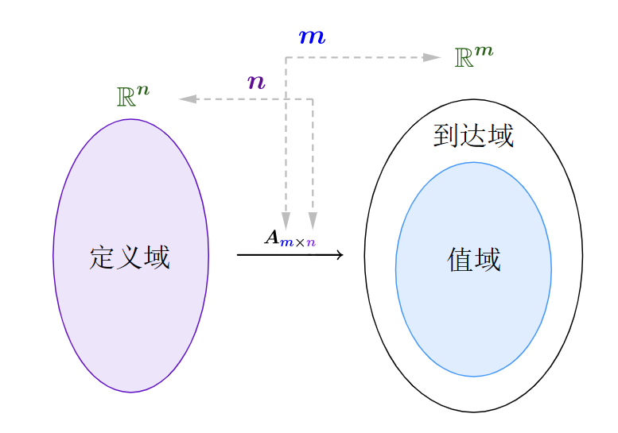
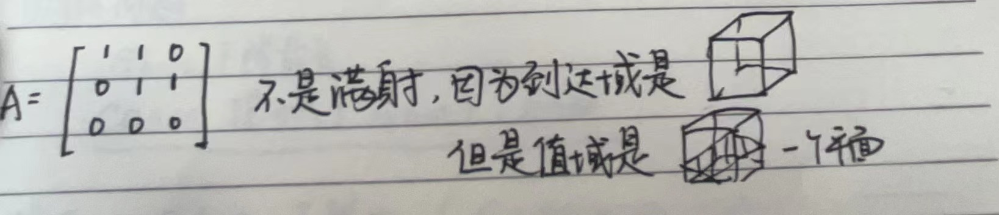
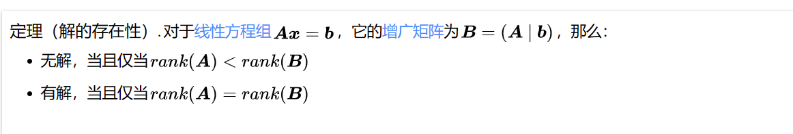
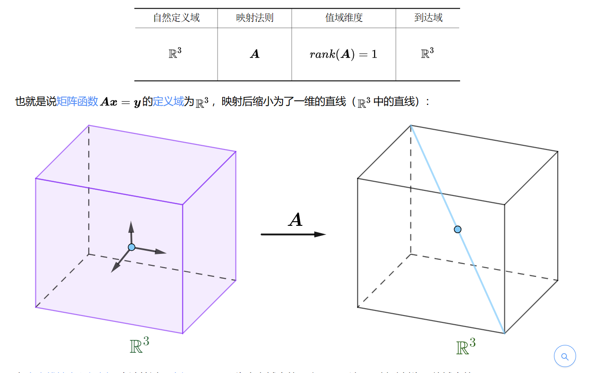
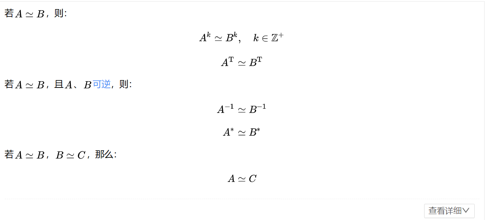
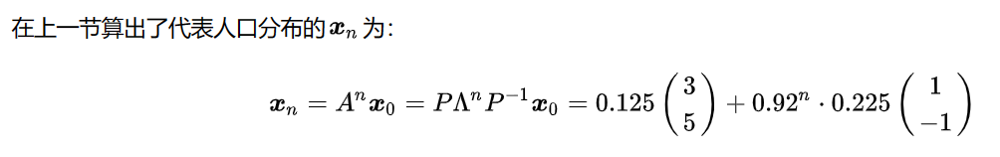
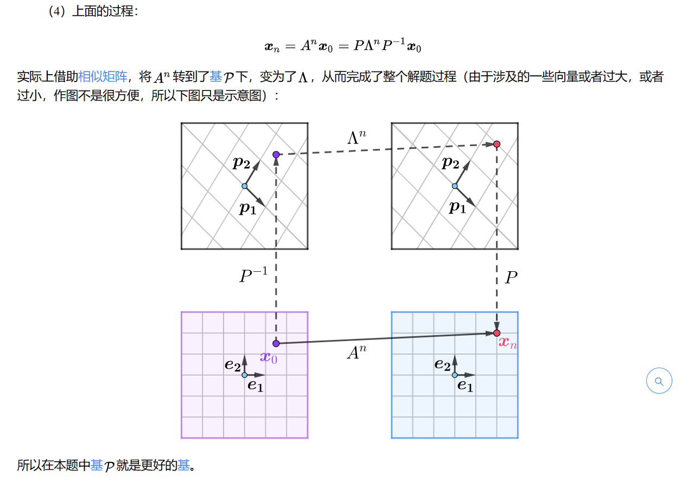
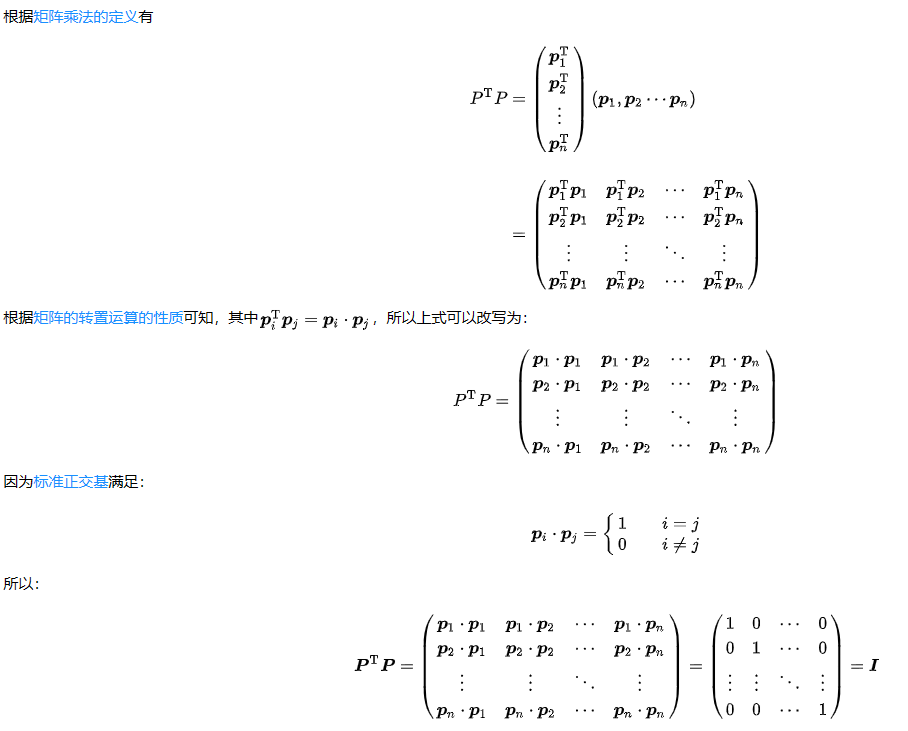
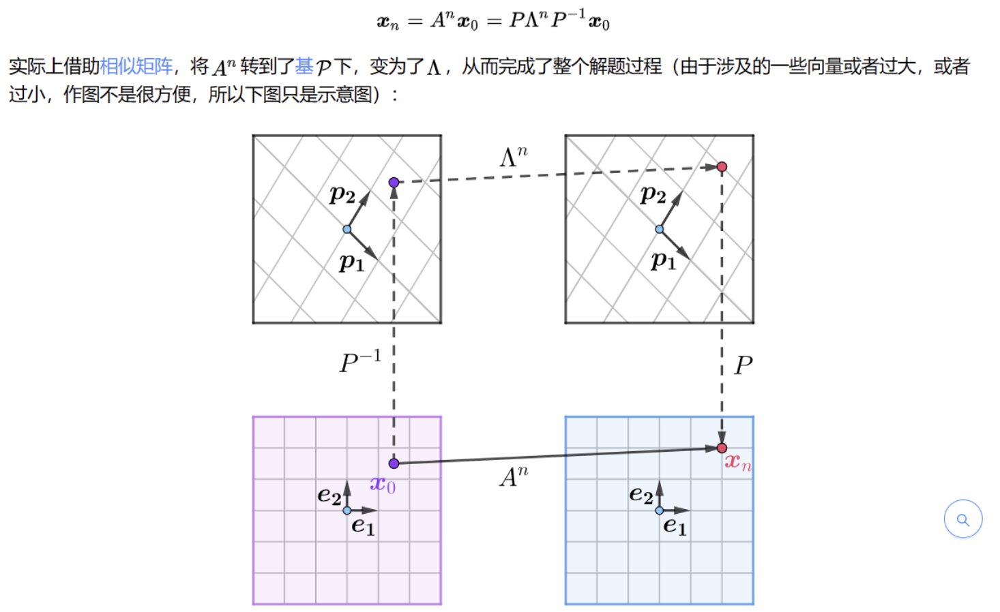
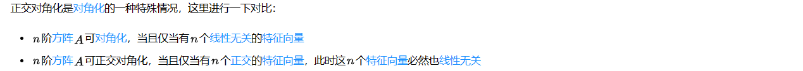

领域:: 数学

- [MIT—线性代数笔记](https://omnivore.app/me/mit-14-18c6d27ea89) **金牌笔记** #学习网址 #线性代数
  site:: [知乎专栏](https://zhuanlan.zhihu.com/p/45861456)
- 线性代数中的[[零空间]]和**AX=B**的通解
  collapsed:: true
	- 零空间的维数和什么相等？
	  card-last-interval:: 8.81
	  card-repeats:: 1
	  card-ease-factor:: 2.6
	  card-next-schedule:: 2023-12-25T19:41:42.572Z
	  card-last-reviewed:: 2023-12-17T00:41:42.572Z
	  card-last-score:: 5
		- 和自由变量的个数相等
	- 为什么[[零空间]]对自由向量分别赋值为[0,0,1]这种，之后的线性组合可以表示整个零空间？
	  card-last-interval:: 8.81
	  card-repeats:: 1
	  card-ease-factor:: 2.6
	  card-next-schedule:: 2023-12-25T19:41:36.478Z
	  card-last-reviewed:: 2023-12-17T00:41:36.479Z
	  card-last-score:: 5
		- 因为这样子求出来的关于零空间的特解是线性无关的
		- 同时这些特解可以张成整个零空间
	- **AX=B**的求法？
	  card-last-interval:: 8.81
	  card-repeats:: 1
	  card-ease-factor:: 2.6
	  card-next-schedule:: 2023-12-25T19:41:33.352Z
	  card-last-reviewed:: 2023-12-17T00:41:33.352Z
	  card-last-score:: 5
		- 首先求出零空间，再求出特解
		- 最后零空间加上特解就是所有的解
- 线性代数中的[[四个基本子空间]]
  collapsed:: true
	- 哪四个基本子空间？
	  card-last-interval:: 8.81
	  card-repeats:: 1
	  card-ease-factor:: 2.6
	  card-next-schedule:: 2023-12-25T19:41:47.475Z
	  card-last-reviewed:: 2023-12-17T00:41:47.476Z
	  card-last-score:: 5
		- 列空间、行空间、零空间，左零空间
	- 对于矩阵$$M \in R^{m\times n}$$，四个基本子空间的维度（这个就是这个向量有几个分量的意思 (1,2,3)的维度就是3，（1,2,3,4,5）的维度就是5）？以及各自子空间的维数？
	  card-last-interval:: 8.81
	  card-repeats:: 1
	  card-ease-factor:: 2.6
	  card-next-schedule:: 2023-12-24T05:56:38.251Z
	  card-last-reviewed:: 2023-12-15T10:56:38.253Z
	  card-last-score:: 5
		- 列空间的维度$$C(A)\in R^m$$，列空间的维数（秩）$$r(C(A)) = r$$;左零空间的维度$$N(A^T)\in R^m$$，左零空间的维数（秩）$$N(C(A^T)) = m-r$$，**所以列空间和左零空间的维数和为m**
		- 行空间的维度$$C(A^T)\in R^n$$，列空间的维数（秩）$$r(C(A^T)) = r$$;零空间的维度$$N(A)\in R^n$$，[[零空间]]的维数（秩）$$N(C(A)) = n-r$$，**所以行空间和零空间的维数和为n**
	- 这四个子空间之间的关系？
	  card-last-interval:: 8.81
	  card-repeats:: 1
	  card-ease-factor:: 2.6
	  card-next-schedule:: 2023-12-25T19:41:30.735Z
	  card-last-reviewed:: 2023-12-17T00:41:30.735Z
	  card-last-score:: 5
		- 行空间和零空间为正交子空间
			- [[正交子空间]]:[子空间**S**与子空间**T**正交，则**S**中的任意一个向量都和**T**中的任意向量正交。](https://zhuanlan.zhihu.com/p/45861456#:~:text=%E5%AD%90%E7%A9%BA%E9%97%B4S%E4%B8%8E%E5%AD%90%E7%A9%BA%E9%97%B4T%E6%AD%A3%E4%BA%A4%EF%BC%8C%E5%88%99S%E4%B8%AD%E7%9A%84%E4%BB%BB%E6%84%8F%E4%B8%80%E4%B8%AA%E5%90%91%E9%87%8F%E9%83%BD%E5%92%8CT%E4%B8%AD%E7%9A%84%E4%BB%BB%E6%84%8F%E5%90%91%E9%87%8F%E6%AD%A3%E4%BA%A4%E3%80%82)
- [[投影空间]]的值？投影空间和[[最小二乘法]]的关系，投影空间P的性质？
  card-last-interval:: 8.81
  card-repeats:: 1
  card-ease-factor:: 2.6
  card-next-schedule:: 2023-12-25T19:41:21.337Z
  card-last-reviewed:: 2023-12-17T00:41:21.338Z
  card-last-score:: 5
  collapsed:: true
	- $P = A(A^TA)^{(-1)}A^T$，最小二乘法就是将一个无解AX=B的问题，通过投影空间，变为$$A \hat{X}=p$$的过程，投影空间保证P在A的列空间内，并且保证误差最小
	- P的性质：P的n次方还是P
- 旋转矩阵
  collapsed:: true
	- 椭圆旋转
- 矩阵函数的秩
  collapsed:: true
	- 行秩等于列秩
	- 复合函数的秩
	  矩阵AB可以看成是矩阵A的列向量的线性表出，故R（AB）≤R（A），也可以看成是矩阵B的行向量的线性表出，故R（AB）≤R（B）
- 矩阵函数  [马同学这里的讲解很清晰，花点时间把这个章节看一遍](https://www.matongxue.com/lessons/544)
  collapsed:: true
	- 对于列空间而言，定义域是系数的维度，到达域是空间的维度
	  {:height 390, :width 487}
	- 矩阵函数的单射和双射情况
	- 从矩阵函数**单射和满射**的角度去理解线性方程解的情况
		- 满射：
			- 对于列空间而言$Ax=b$而言，如果$A$是行满秩，那么$Ax=b$就是满射的，理解如下
			  > 对于维度为$m\cdot n$的矩阵函数$A$而言，其到达域是$m$，为了满射，也就是让值域空间的向量也能够和达到域的向量维度一致，那么就必须满足行满秩  也就是值域的向量一定在每一个坐标值上都有坐标，而不是0
- 初等行变换和初等列变换
- 线性方程组的解
  collapsed:: true
	- 
	  > **如果增广矩阵秩增加，则表明结果向量和系数矩阵向量组线性不相关。**
	- 满射，指的是到达域和值域的维度一致，和定义域维度无关，意思是我到达域中的每一个点都可以被映射出来，比如$A\in3\cdot1000$是行满秩，我们知道他的到达域的维度就是3，那么现在又是行满秩，那么就可以知道他到达域中的每一个点都可以被映射出来，所以是满射，那么一定存在解。与此同时，他的定义域维度是1000，所以定义域到值域是一定被降维了，在值域中的一个点在定义域中由很多向量都可以映射到，所以一定存在无数个解。
	- 秩零定律
		- 设$A$的大小为$m\cdot n$，$n$元齐次方程组$AX=0$的解集为秩$R_{S}$，则$n=rank\left(A\right)+R_{S}$
		- > 这里的解释分为几个方面，首先定义域的维度，指的是定义域中向量由多少基构成，而不是单纯的从向量有几个坐标而言，比如$A\in4\cdot6$的定义域维度是6，首先根据矩阵相乘的合法性，可知与该矩阵做乘法的向量肯为形如$\left(1,2,3,4,5,6\right)^T$，我们说定义域的维度是6，代表的在六维空间中的所有点，都可以与这个矩阵做乘法，而这个六维空间的基是六，所以我们说定义域的维度是6。
		   
		  比如这里的定义域是3，代表的是所有三维空间中的点都可以与矩阵相乘，而三维空间的基的个数是3，所以定义域的维度是3。同理，$A\in4\cdot6$中到达域是4，指的是我乘积之后的向量按照道理来说，应该在维度为4的空间中，也就是按照道理来说，应该是在由四个基地构成的空间中，但是实际上的值域是更小的，因为我值域是和$Rank\left(A\right)$相同的，意思就是值域能够由多少基地构成，是和列空间由多少线性无关的列向量相同的，而有多少线性无关的列向量，就有多少的$Rank\left(A\right)$。
- 相似矩阵
  collapsed:: true
	- [相似矩阵](https://www.matongxue.com/lessons/1177/parts/4596) 其中的视频讲解非常的不错
	- 相似矩阵的性质
		- 
	- 相似矩阵的例题，人口计算
	  
	  可以这样子理解相似变换，实际上因为直接计算$A^{n}$在原始的基底下不好计算，所以希望采用新的基底做变换，那么特征向量构成的这个基底，因为线性无关，并且可以构成对角矩阵，所以可以很好的帮助我们把计算过程转换到特征向量构成的空间中进行计算。
	  
	  $\lambda$矩阵是A矩阵的最最特殊，已知量最多【包含特征值特征向量】的相似矩阵，实际应用起来无论是想迭代运算N次方还是单纯想抽象出A矩阵的属性都极度便利。
	- 相似矩阵中的不变量
		- 相似矩阵的特征值相同
		- 相似矩阵的迹相同，其中迹等于特征值之和
		- 相似矩阵的特征值相同
- 标准正交基
  collapsed:: true
	- 标准正交基为什么好？
	  collapsed:: true
		- 因为标准正交基组成的向量组就是自然标准正交基的过度矩阵
		  $$v=P\bar{v}$$
		  其中$\bar{v}$是在标准正交基下的向量坐标，如果我需要把他转化到自然标准正交基下，那么只需要让它在该标准正交基下的坐标，乘上该标准正交基即可
		  与此同时，如果我想求自然标准正交基下的向量坐标在其他标准正交基下的向量坐标，那么我只需要乘上过度矩阵的逆矩阵，**正交矩阵的逆矩阵和转置矩阵相同**，所以
		  $$P^{-1}v = \bar{v} \to P^{T}v = \bar{v}$$
		  > 
	- 根据前面所说的相似矩阵的意义以及标准正交基的性质，如果我们的任务是要在基\epsilon下完成矩阵函数将x->y的映射，可能会很复杂，所以我们希望借助相似矩阵的方法来完成这个计算，希望可以
	  {:height 889, :width 1438}
	  过程，完成在基\tau下，相似矩阵$\lambda$帮助我们简化计算，此时我们还会发现一个问题，计算逆矩阵很麻烦（P是很容易得到的，就是类似于一个坐标变换或者过度矩阵，因为基\tau是已知的），因此，我们希望可以使用标准正交基，因为标准正交基的逆矩阵就是转置矩阵，现在问题就是如何根据我已知的基找到相同向量空间下的标准正交基呢？这就是[[施密特正交化]]，并且，如果对相同特征值的特征向量进行正交化，正交的结果依然是特征向量，所以相似矩阵$\lambda$还是以特征值为作为对角矩阵，不需要改变。具体为啥不知道
	- 正交对角化
		- 正交对角化
		  
- 二次型
  collapsed:: true
	- 定义
	- 合同矩阵