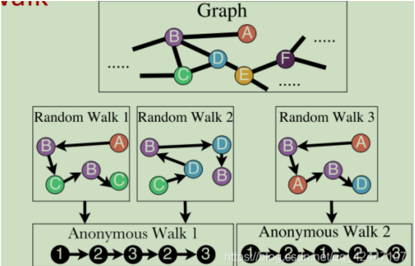

- 节点嵌入思想
	- 需要定义**三个**东西
		- 定义节点、图的表现形式，例如通过Deepwalk、node2vec得到的邻接关系，这是从图中能够提取的原始信息
		- 定义能从图嵌入中重现图表现的函数，**需要使用到第一步得到的图表现形式**，例如$$\phi = \frac{{\exp(z_u z_v^T)}}{{\sum \exp(z_u z_n^T)}}$$的计算范围是对一个节点Deepwalk得到的领域节点对之间的表示，这个值越大，代表图嵌入是有效的
		- 定义优化函数，当$$\phi$$能表现重现时，优化函数小，不能时，优化函数越大
			- $$L = \sum\sum-log\phi,\phi \in (0,1)$$
- 节点嵌入方法
	- node2vec，deepwalk等
	- node2vec定义了二阶随机游走，定义了p、q这两个值来决定是具有更远离出发节点还是更接近出发节点的概率
- 图嵌入
	- 思路一：用所有节点嵌入的平均来代表节点嵌入，虽然简单但是有效
	- 思路二：定义虚拟节点，然后嵌入虚拟节点（嵌入子图）
	- 思路三：Anonymous Walks Embedding（匿名游走）
		- 匿名游走： {:height 278, :width 372}
		- 匿名游走使用一：类似于 [[GDV 图元度向量]]，根据匿名游走的数量类型的比例定义图嵌入向量，比如进行长度为5的匿名游走，那么一共有52中情况，定义图嵌入向量的长度为52，每一个向量元素就是相应匿名游走的比例（所有节点都进行匿名游走，然后计算所有的数量和相应类型的匿名游走的比例）
		- **匿名游走使用二**：和[[节点嵌入]]的思想类似。
			- ①从图中得到的表现就是匿名游走
			- ②重现函数是
			  $$
			  \max\limits_{z,d}\frac{1}{T}\sum_{t=\Delta}^{T-\Delta}\log P(w_t | {t_{t-\Delta},\ldots,w_{t+\Delta}},z_G)
			  $$
			  这里的\Delta 是窗宽度的意思，代表使用多少宽度的窗进行预测，比如\Delta = 2，使用\[w_3\]左右的\[w_1,w_2,w_4,w_5\]进行预测\[w_2\]，所以重现函数的意思就是对所有匿名游走都运用一次预测，然后计算平均值
				- 其中，
				  $$\log P(w_t | {t_{t-\Delta},\ldots,w_{t+\Delta}},z_G) = \frac{exp(y(w_t))}{\sum_{i=1}^{\eta}exp(y(w_i))}$$
				  $$y(w_t) = b + U(cat(\frac{1}{2\Delta}\sum_{i = -\Delta}^{\Delta}z_i,z_G)$$b,U是可学习参数，\[y(w_t)\]相当于计算了通过窗两边的值加上整个图的嵌入预测需要预测的值的函数