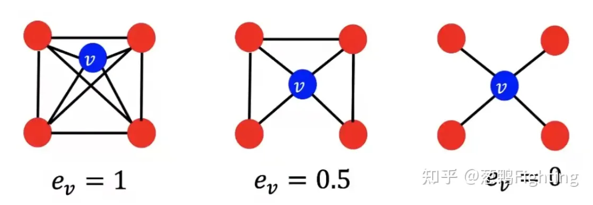
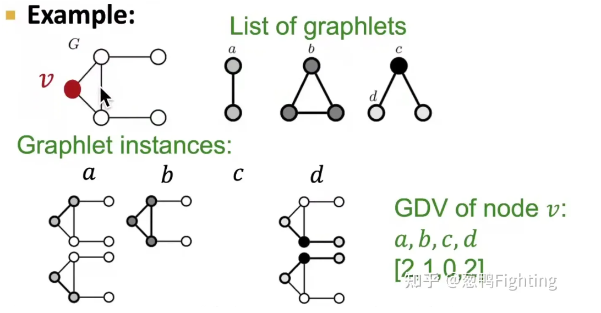

- 总体来说，节点水平的特征提取可以分为两大类：
	- 基于**节点重要性的特征**，衡量了某节点在网络中的重要程度，如：节点度，节点中心性度量；
	- 基于**结构的特征**，能够捕捉节点周围领域的拓扑属性，如：节点度，聚类系数，图元度向量
- 节点度
	- 最基本的量，用每一个节点的所包含的领居(度)来表示节点的重要性或者结构，每一个领居具有相同的重要性
- 节点中心性度量
	- {{embed ((65799dc0-b8d4-481b-841e-0fc659fe678e))}}
	- {{embed ((65799ee6-5a30-4a01-a119-cdf4804c67ba))}}
	- 接近中心性
		- 若一个节点到其他所有节点的最短路径长度越小，那么它在网络中的重要性越高
		- $$C = \sum_{u\neq v}\frac{1}{最短路径的长度}$$
- [[聚类系数]]
	- 聚类系数衡量了**节点的邻居节点之间的连接性高低**，若它的邻居节点之间相互连接的越多，则聚类系数越大
		- 衡量的是节点的领居之间的连接性，所以如果领居直接也存在链接，那么必然有三角形的存在
		- 举例示意
		  {:height 284, :width 781}
			- assets:///D%3A/iCloud~com~logseq~logseq/assets/image_1704006337116_0.png
- [[GDV 图元度向量]]
	- 图元度向量**对事先指定的图元**（graphlet）结构进行了计数统计，从而反映了网络的结构特征。**特别注意**，这里是对事先指定的图元结构进行计数统计
	- 指定图元，图元度向量统计了网络中以给定节点为根的图元个数。以下图为例，网络$$G$$中的$$V$$是我们要观察的根节点，$$a-d$$指定了4种不同的图元结构，**虽然只有三个图元，但是从根节点的角度出发，指定的三种图元中一共有四种不同的根节点，而第c类根节点就是不存在的，因为$$G$$上不存在已V为根节点，然后其邻居节点之间没有联系这种结构**，以$$V$$为根节点对网络$$G$$中四种指定的图元结构进行计数统计，各图元出现的次数分别为$$2,1,0,2$$，所以我们得到V的GDV是$$[2,1,0,2]$$
	  {:height 458, :width 854}
	-
-
-